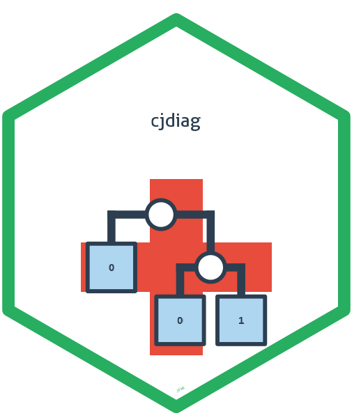
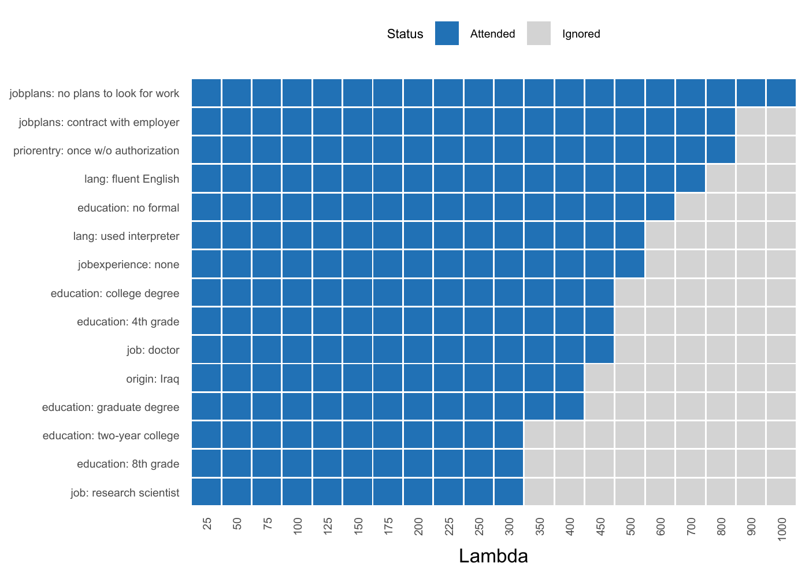
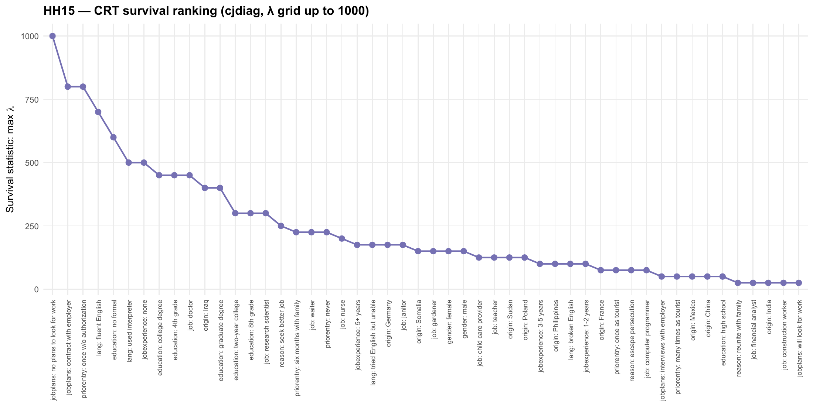

<!-- README.md is generated from README.Rmd. Please edit that file -->

```{r, include = FALSE}
knitr::opts_chunk$set(
  collapse = TRUE,
  comment = "#>",
  fig.path = "man/figures/README-",
  out.width = "100%",
  dpi = 300,
  fig.width = 9.6,
  fig.height = 5.4,
  fig.retina = 2
)
```

# cjdiag 

<!-- badges: start -->
[](https://github.com/dkarpa/cjdiag/actions/workflows/R-CMD-check.yaml)
[](https://lifecycle.r-lib.org/articles/stages.html#experimental)
<!-- badges: end -->

Tools for attribute-level importance and attendance in conjoint survey experiments --- which attribute levels drive choices, how they rank, and which ones respondents ignore.

## Why cjdiag?

Standard conjoint analysis tools ([cjoint](https://cran.r-project.org/package=cjoint), [cregg](https://github.com/leeper/cregg)) estimate *what* respondents prefer --- Average Marginal Component Effects (AMCEs) and marginal means. But they cannot tell you *how* respondents decide: which attributes they actually attend to, whether they process information hierarchically, or which attribute levels they ignore entirely.

**cjdiag** fills this gap with five diagnostic methods that reveal the decision process behind conjoint choices.

## Installation

```r
# Install from GitHub (CRAN submission pending)
# install.packages("pak")
pak::pak("dkarpa/cjdiag")
```

## Quick Start

```{r quick-start}
library(cjdiag)
data(immig)

rf <- cj_fit(
  Chosen_Immigrant ~ Gender + Education + LanguageSkills +
    CountryofOrigin + Job + JobExperience + JobPlans +
    ReasonforApplication + PriorEntry,
  data = immig,
  method = "forest"
)

rf
```

The full results table is the main output. Each row is one attribute level. The columns:

- **rank** --- position in the importance ordering. Rank 1 = the level that does the most work in driving choices.
- **attribute** --- the conjoint attribute (the question the level answers, e.g. *what is this immigrant's reason for applying?*).
- **level** --- the specific value of that attribute (e.g. *escape persecution*).
- **mda** --- *Mean Decrease in Accuracy*. How much the forest's predictive accuracy drops when the information in this level is shuffled away. Higher = this level genuinely shapes choices. Levels with `mda` near zero are effectively ignored.
- **root_pct** --- % of trees in the forest where this level is the *first* split. A high value means respondents tend to *start* their decision by checking this level. This is the **gatekeeper signal**.
- **class_0** --- how strongly this level pushes respondents to *reject* a profile. A "veto" signal.
- **class_1** --- how strongly this level pushes them to *select* a profile. An "attractor" signal.

The asymmetry between `class_0` and `class_1` reveals **direction**. `class_0 ≫ class_1` means the level is a deal-breaker (e.g. *no plans to look for work* mostly causes rejection). `class_1 ≫ class_0` means the level is a draw (e.g. *fluent English* mostly causes selection).

```{r rf-results}
knitr::kable(
  head(rf$results, 20)[, c("rank", "attribute", "level", "mda",
                           "root_pct", "class_0", "class_1")],
  digits = 2
)
```

### Importance by Rank

```{r rf-rank}
plot(rf, type = "rank", top_n = 20)
```

### Decision Tree

```{r tree}
tr <- cj_fit(
  Chosen_Immigrant ~ Gender + Education + LanguageSkills +
    CountryofOrigin + Job + JobExperience + JobPlans +
    ReasonforApplication + PriorEntry,
  data = immig,
  method = "tree"
)

plot(tr)
```

### Nested Marginal Means

```{r nmm}
nmm <- cj_fit(
  Chosen_Immigrant ~ Gender + Education + LanguageSkills +
    CountryofOrigin + Job + JobExperience + JobPlans +
    ReasonforApplication + PriorEntry,
  data = immig,
  method = "nmm",
  resp_id = "CaseID",
  n_boot = 0
)

plot(nmm, type = "cumulative", top_n = 20)
```

### CRT Lambda-Survival

The CRT survival statistic — the largest L1 penalty $\lambda$ at which a level's coefficient is still nonzero — gives a one-number attendance ranking. Below, fit to HH15 with a $\lambda$ grid up to 1000.

```{r crt, eval = FALSE}
crt <- cj_fit(
  Chosen_Immigrant ~ Gender + Education + LanguageSkills +
    CountryofOrigin + Job + JobExperience + JobPlans +
    ReasonforApplication + PriorEntry,
  data = immig,
  method = "crt",
  lambda_grid = c(seq(25, 250, 25), seq(300, 500, 50), seq(600, 1000, 100))
)

plot(crt, type = "survival", top_n = 15)   # coefficient path
plot(crt, type = "rank")                    # connected-dot survival ranking
```





## Methods

All methods are accessed through a single function: `cj_fit(formula, data, method)`.

| Estimand | `method =` | Question | Output | Behavioural assumption | When to use |
|----------|-----------|----------|--------|-----------------------|-------------|
| **Level importance** | `"forest"` | Which attribute levels matter most? | MDA, root-split rate per level | None — non-parametric | Default. Always fit this first. |
| **Decision structure** | `"tree"` | How do respondents structure their decisions? | Hierarchical CART splits | Lexicographic / sequential | When you suspect a gatekeeper. |
| **Level attendance** | `"crt"` | Which levels survive a strict signal-vs-noise test? | Lambda-survival, attended/ignored | Sparsity (most levels are noise) | When you want a hard attendance test. |
| **Decision order** | `"nmm"` | In what order do levels settle choices? | Decisiveness ranking, cumulative % | Sequential elimination (EBA) | When you care about the decision *order*. |
| **Individual attendance** | `"marginal_r2"` | Which attributes did each respondent actually use? | Per-respondent R² matrix | Per-respondent simple-regression fit | When you want individual-level heterogeneity. |

## Plot Customization

All plot methods return ggplot2 objects and accept customization parameters:

```{r customization, eval = FALSE}
# Colorblind-safe palette
plot(rf, palette = "colorblind")

# Rename attributes in display
plot(rf, attribute.names = c(LanguageSkills = "English Proficiency"))

# Full ggplot2 theme override
plot(rf, theme = ggplot2::theme_classic(base_size = 14))
```

Three palettes available: `"default"`, `"colorblind"` (Okabe-Ito), `"grey"`.

Set defaults once with `set_cjdiag_theme()` and `set_cjdiag_labels()`.

## Related Packages

**cjdiag** is complementary to packages that estimate AMCEs and design conjoint experiments:

- [cjoint](https://cran.r-project.org/package=cjoint) --- AMCE estimation (Hainmueller, Hopkins & Yamamoto)
- [cregg](https://github.com/leeper/cregg) --- AMCE and marginal means with tidy output
- [projoint](https://cran.r-project.org/package=projoint) --- full conjoint pipeline
- [cbcTools](https://cran.r-project.org/package=cbcTools) --- conjoint experiment design and power analysis

Run cjoint or cregg for AMCEs, then cjdiag to diagnose how respondents actually made those choices.

## Getting Started

For a full walkthrough, see the [Getting Started vignette](https://dkarpa.github.io/cjdiag/articles/cjdiag.html). Each method has its own task-oriented vignette: [forest](https://dkarpa.github.io/cjdiag/articles/forest.html), [tree](https://dkarpa.github.io/cjdiag/articles/tree.html), [nmm](https://dkarpa.github.io/cjdiag/articles/nmm.html), [marginal_r2](https://dkarpa.github.io/cjdiag/articles/marginal_r2.html), [crt](https://dkarpa.github.io/cjdiag/articles/crt.html).

## Citation

```{r, eval = FALSE}
citation("cjdiag")
```

```{r, echo = FALSE, comment = ""}
citation("cjdiag")
```

## Funding

David Karpa acknowledges financial support from the European Research Council (ERC) under the European Union's Horizon Europe research and innovation programme --- project AGAPP "Algorithmic Governance -- A Public Perspective" (ERC Starting Grant, grant agreement No. 101116772, PI: Prof. Daria Gritsenko), where he works as a postdoctoral researcher.
