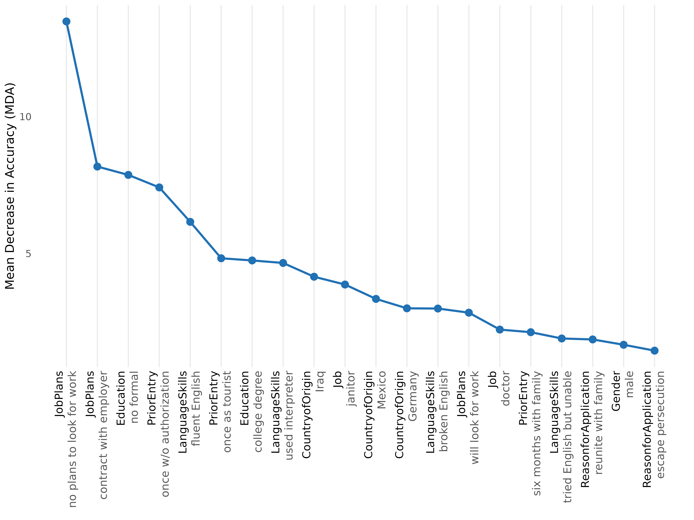
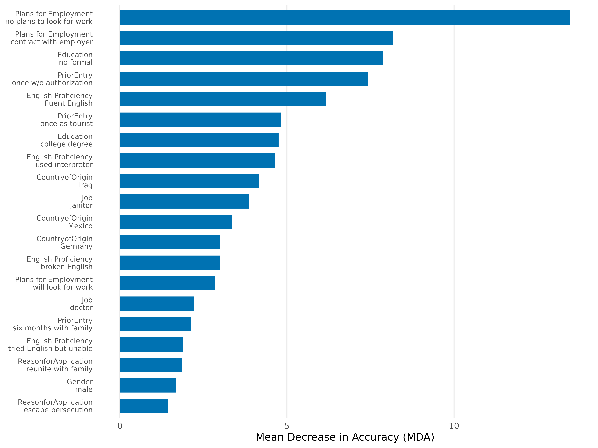
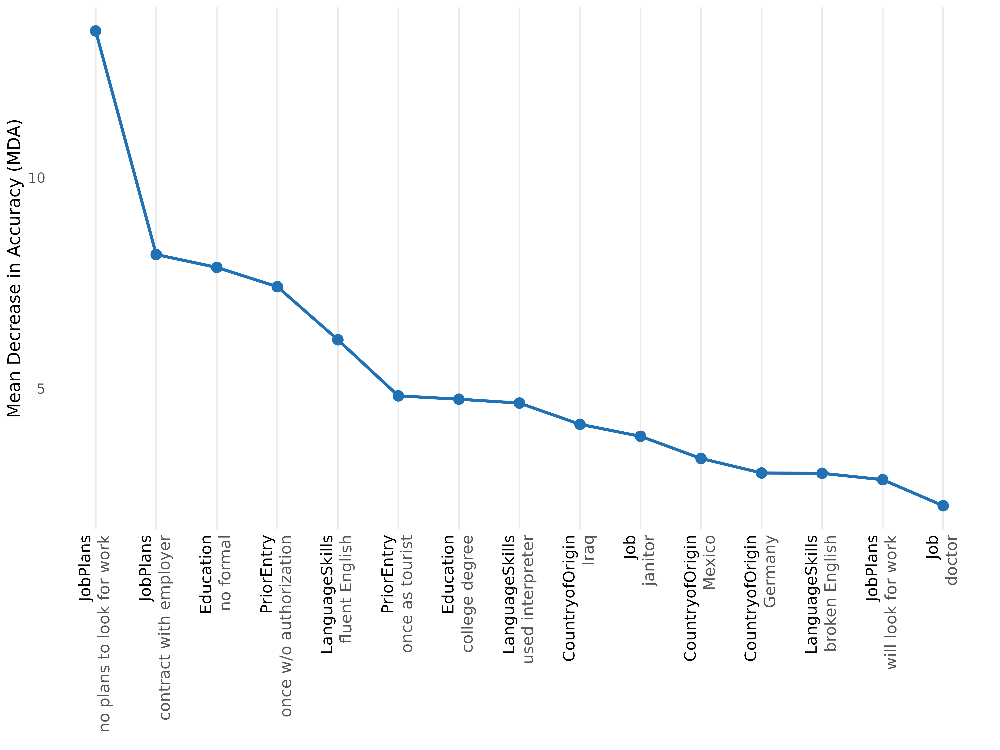

# Getting Started with cjdiag

## 1. What cjdiag does

Standard conjoint analysis tools estimate Average Marginal Component
Effects (AMCEs) — the causal effect of changing a single attribute
level. AMCEs tell you *what* respondents prefer, but not *how* they
decide: which attribute levels they actually attend to, which ones they
ignore, and in what order they process information.

**cjdiag** fills that gap. It works at the level of individual
**attribute levels** — not aggregated attributes — because the specific
level (e.g., “no plans to look for work”, not just “Job Plans” as a
whole) is what triggers respondent decisions.

cjdiag is complementary to `cjoint`/`cregg` (which estimate AMCEs). The
intended workflow is: run those for AMCEs first, then run cjdiag to
diagnose how respondents actually made those choices.

## 2. Quick start

``` r

library(cjdiag)
data(immig)

f <- Chosen_Immigrant ~ Gender + Education + LanguageSkills +
  CountryofOrigin + Job + JobExperience + JobPlans +
  ReasonforApplication + PriorEntry

rf <- cj_fit(f, data = immig, method = "forest")
rf
#> Conjoint Random Forest 
#> ====================== 
#> 
#> Resolution: levels
#> Trees: 500
#> OOB Error: 40.3%
#> Observations: 2,000
#> Attributes: 9
#> Levels: 50
#> 
#> Top 10 levels by MDA:
#> 
#> # A tibble: 10 × 7
#>     rank attribute       level                      mda root_pct class_0 class_1
#>    <int> <chr>           <chr>                    <dbl>    <dbl>   <dbl>   <dbl>
#>  1     1 JobPlans        no plans to look for wo… 13.5      15.4  12.3      7.25
#>  2     2 JobPlans        contract with employer    8.18     11.2   3.70     6.98
#>  3     3 Education       no formal                 7.87      7.4   8.04     2.38
#>  4     4 PriorEntry      once w/o authorization    7.42     10.4   6.87     3.66
#>  5     5 LanguageSkills  fluent English            6.16      8.2   2.71     6.00
#>  6     6 PriorEntry      once as tourist           4.83      2.4   1.61     5.25
#>  7     7 Education       college degree            4.75      6.4   0.153    6.16
#>  8     8 LanguageSkills  used interpreter          4.66      5.6   4.91     1.37
#>  9     9 CountryofOrigin Iraq                      4.15      4.6   3.53     2.15
#> 10    10 Job             janitor                   3.87      3     2.09     3.36
```

``` r

plot(rf, type = "rank", top_n = 20)
```



## 3. Choosing a method

| Estimand | `method =` | Question | Output | Behavioural assumption | When to use |
|----|----|----|----|----|----|
| **Level importance** | `"forest"` | Which attribute levels matter most? | MDA, root-split rate per level | None — non-parametric | Default. Always fit this first. |
| **Decision structure** | `"tree"` | How do respondents structure their decisions? | Hierarchical CART splits | Lexicographic / sequential | When you suspect a gatekeeper. |
| **Level attendance** | `"crt"` | Which levels survive a strict signal-vs-noise test? | Lambda-survival, attended/ignored | Sparsity (most levels are noise) | When you want a hard attendance test. |
| **Decision order** | `"nmm"` | In what order do levels settle choices? | Decisiveness ranking, cumulative % | Sequential elimination (EBA) | When you care about the decision *order*. |
| **Individual attendance** | `"marginal_r2"` | Which attributes did each respondent actually use? | Per-respondent R² matrix | Per-respondent simple-regression fit | When you want individual-level heterogeneity. |

Each method also has its own task-oriented vignette:
[forest](https://dkarpa.github.io/cjdiag/articles/forest.md),
[tree](https://dkarpa.github.io/cjdiag/articles/tree.md),
[nmm](https://dkarpa.github.io/cjdiag/articles/nmm.md),
[marginal_r2](https://dkarpa.github.io/cjdiag/articles/marginal_r2.md),
[crt](https://dkarpa.github.io/cjdiag/articles/crt.md).

## 4. `cj_fit()` — full reference

[`cj_fit()`](https://dkarpa.github.io/cjdiag/reference/cj_fit.md) is the
single entry point. It dispatches on `method` and returns an S3 object
inheriting from `cjdiag_fit`.

### Signature

``` r

cj_fit(formula, data, method = c("forest", "tree", "crt", "nmm",
                                  "marginal_r2"),
       resolution = c("levels", "attributes"),
       ntree = 500L, cp = 0.005,
       lambda_grid = c(1, 2, 3, 5, 7, 10, 15, 20, 25, 30,
                       40, 50, 75, 100, 150, 200, 300, 400, 500),
       n_folds = 5L, n_perm = 20L, tol = 1e-3,
       resp_id = NULL, n_boot = 0L,
       seed = 42L, ...)
```

### Required arguments

- **`formula`** — a formula `outcome ~ attr1 + attr2 + ...`. The outcome
  must be binary (0/1, logical, or a 2-level factor); predictors are
  treated as categorical (converted to factors internally).
- **`data`** — a data frame in long format, i.e. one row per profile.

### Method choice

- **`method`** — one of `"forest"` (default), `"tree"`, `"crt"`,
  `"nmm"`, `"marginal_r2"`. See §3.

### Resolution

- **`resolution`** — `"levels"` (default) or `"attributes"`.
  - `"levels"` dummy-codes every attribute level and treats each as a
    separate predictor. The recommended default — importance is a
    property of *specific levels*, not aggregated attributes.
  - `"attributes"` passes the original factor columns to the model.
    Available for `forest` and `tree` only. CRT, NMM and `marginal_r2`
    require `"levels"` and will error otherwise.

### Method-specific arguments

| Argument | Methods | Default | Purpose |
|----|----|----|----|
| `ntree` | `forest` | `500L` | Number of trees in the random forest. |
| `cp` | `tree` | `0.005` | rpart complexity parameter. Smaller = deeper trees. |
| `lambda_grid` | `crt` | 19 values from 1 to 500 | L1 regularization path for hierNet. **Must extend well past 50** — typical signal-vs-noise separation occurs in the 100–500 range. |
| `n_folds` | `crt` | `5L` | Cross-validation folds. |
| `n_perm` | `crt` | `20L` | Permutation rounds for permutation importance. |
| `tol` | `crt` | `1e-3` | hierNet convergence tolerance. |
| `resp_id` | `nmm`, `marginal_r2` | `NULL` | **Required.** Name of the respondent ID column. |
| `n_boot` | `nmm` | `0L` | Bootstrap iterations for NMM CIs. `0` disables. |

### Reproducibility

- **`seed`** — random seed; default `42L`. Set explicitly for any run
  you want to reproduce.

### Pass-through

- **`...`** — additional arguments forwarded to
  [`randomForest::randomForest()`](https://rdrr.io/pkg/randomForest/man/randomForest.html),
  [`rpart::rpart()`](https://rdrr.io/pkg/rpart/man/rpart.html), or
  [`hierNet::hierNet()`](https://rdrr.io/pkg/hierNet/man/hierNet.html)
  depending on `method`.

### Errors and validation

[`cj_fit()`](https://dkarpa.github.io/cjdiag/reference/cj_fit.md) errors
with a structured `cli` message in these cases:

- `data` is not a data frame, or has zero rows.
- `method = "crt"` or `"nmm"` is combined with
  `resolution = "attributes"`.
- `method = "nmm"` or `"marginal_r2"` is called without `resp_id`.
- The formula’s outcome is not binary.
- An attribute named in the formula is missing from `data`.

### Return value

An S3 object. The exact subclass depends on `method`: `cjdiag_forest`,
`cjdiag_tree`, `cjdiag_crt`, `cjdiag_nmm`, `cjdiag_marginal_r2`. All
inherit from `cjdiag_fit` and support
[`print()`](https://rdrr.io/r/base/print.html),
[`plot()`](https://rdrr.io/r/graphics/plot.default.html),
[`summary()`](https://rdrr.io/r/base/summary.html), and
[`importance()`](https://dkarpa.github.io/cjdiag/reference/importance.md).

The object is a list. Common slots: `model` (the underlying fit),
`method`, `resolution`, `results` (the importance tibble), `formula`,
`outcome`, `attributes`, `n_obs`, `n_levels`, `attr_map`, `seed`.
Method-specific slots (`oob_error`, `ntree` on forest; `root_split`,
`depth`, `n_terminal`, `cp` on tree; `optimal_lambda`, `lambda_1se`,
`accuracy` on crt; `n_boot` on nmm; `r2_matrix` on marginal_r2) round it
out.

## 5. `importance()` — extracting the results table

[`importance()`](https://dkarpa.github.io/cjdiag/reference/importance.md)
is the S3 generic that returns a `cjdiag_importance` object — a tidy
tibble of per-level importance metrics plus a few summary slots. Methods
are dispatched on the fit’s class.

``` r

imp <- importance(rf)
imp
#> Conjoint Importance Metrics 
#> =========================== 
#> 
#> Resolution: levels
#> Method: Random Forest (500 trees)
#> OOB Error: 40.3%
#> 
#> Level Importance (top 10 ):
#> 
#> # A tibble: 10 × 9
#>     rank attribute       level       mda   mdg root_pct class_0 class_1 var_name
#>    <int> <chr>           <chr>     <dbl> <dbl>    <dbl>   <dbl>   <dbl> <chr>   
#>  1     1 JobPlans        no plans… 13.5   28.2     15.4  12.3      7.25 JobPlan…
#>  2     2 JobPlans        contract…  8.18  23.0     11.2   3.70     6.98 JobPlan…
#>  3     3 Education       no formal  7.87  18.7      7.4   8.04     2.38 Educati…
#>  4     4 PriorEntry      once w/o…  7.42  22.9     10.4   6.87     3.66 PriorEn…
#>  5     5 LanguageSkills  fluent E…  6.16  22.3      8.2   2.71     6.00 Languag…
#>  6     6 PriorEntry      once as …  4.83  20.3      2.4   1.61     5.25 PriorEn…
#>  7     7 Education       college …  4.75  18.9      6.4   0.153    6.16 Educati…
#>  8     8 LanguageSkills  used int…  4.66  20.2      5.6   4.91     1.37 Languag…
#>  9     9 CountryofOrigin Iraq       4.15  17.1      4.6   3.53     2.15 Country…
#> 10    10 Job             janitor    3.87  18.0      3     2.09     3.36 Jobjani…
```

Coerce to a data frame for downstream work:

``` r

head(as.data.frame(imp))
#>   rank      attribute                     level       mda      mdg root_pct
#> 1    1       JobPlans no plans to look for work 13.478845 28.16033     15.4
#> 2    2       JobPlans    contract with employer  8.177931 22.97810     11.2
#> 3    3      Education                 no formal  7.872982 18.74837      7.4
#> 4    4     PriorEntry    once w/o authorization  7.416027 22.91502     10.4
#> 5    5 LanguageSkills            fluent English  6.157514 22.27571      8.2
#> 6    6     PriorEntry           once as tourist  4.827218 20.27154      2.4
#>     class_0  class_1                          var_name
#> 1 12.333363 7.250195 JobPlansno.plans.to.look.for.work
#> 2  3.697133 6.978693    JobPlanscontract.with.employer
#> 3  8.035186 2.376082                Educationno.formal
#> 4  6.870653 3.664381  PriorEntryonce.w.o.authorization
#> 5  2.712916 6.002354      LanguageSkillsfluent.English
#> 6  1.607777 5.250203         PriorEntryonce.as.tourist
```

Per-method slots on the returned object:

- **forest**: `results`, `root_dist`, `oob_error`, `ntree`.
- **tree**: `results`, `root_split`, `depth`.
- **crt**: `results`, `optimal_lambda`, `lambda_1se`, `n_attended`,
  `accuracy`.
- **nmm**: `results`, `n_boot`.
- **marginal_r2**: `results`, `n_resp`, `r2_matrix`.

[`importance()`](https://dkarpa.github.io/cjdiag/reference/importance.md)
makes no copies of the underlying model — it is a thin projection of
`fit$results`. For analyses that need the model itself, use `fit$model`.

## 6. `plot()` — every plot type

All plot methods return `ggplot` objects (except the tree, which renders
via
[`rpart.plot::rpart.plot()`](https://rdrr.io/pkg/rpart.plot/man/rpart.plot.html)
and returns invisibly). All accept the customization parameters in §8.

### 6.1 `plot.cjdiag_forest()`

``` r

plot(forest_obj, type = c("importance", "combined", "rank"),
     top_n = NULL, ...)
```

- `type = "importance"` (default) — vertical bar chart of MDA per level,
  sorted descending.
- `type = "combined"` — dual-axis plot showing MDA bars + root-split
  rate as overlaid points/line. Useful for comparing the two importance
  signals at a glance.
- `type = "rank"` — line plot of MDA against rank, with rotated x-tick
  labels (attribute black, level dark grey). The default for the README
  and the plot type used in §11.

### 6.2 `plot.cjdiag_tree()`

``` r

plot(tree_obj, ...)
```

Renders the decision tree via
[`rpart.plot::rpart.plot()`](https://rdrr.io/pkg/rpart.plot/man/rpart.plot.html).
Splits are relabelled `attribute: level`
(e.g. `JobPlans: no plans to look for work`) via a custom `split.fun`.
Pass any `rpart.plot` argument through `...` to override defaults
(`type = 4`, `extra = 101`, `under = TRUE`, `fallen.leaves = TRUE`,
`box.palette = "BuOr"`, `cex = 0.9`).

### 6.3 `plot.cjdiag_crt()`

``` r

plot(crt_obj, type = c("robustness", "survival", "mda", "cv"),
     top_n = NULL, ...)
```

- `type = "robustness"` (default) — bar chart of `max_lambda` per level
  (the largest λ where the level survives).
- `type = "survival"` — λ-survival curve: which levels keep a non-zero
  coefficient as λ rises.
- `type = "mda"` — permutation importance from the CRT fit.
- `type = "cv"` — cross-validated accuracy across the lambda grid.

### 6.4 `plot.cjdiag_nmm()`

``` r

plot(nmm_obj, top_n = NULL, ...)
```

Cumulative-explanation curve only — the single supported NMM plot since
0.2.1. Earlier `type = "decisiveness"` and `type = "sample"` plots were
removed (the columns remain on the fit object).

### 6.5 `plot.cjdiag_importance()` (generic)

``` r

plot(imp_obj, type = c("mda", "root", "combined", "cumulative",
                       "cumulative_pct"),
     top_n = NULL, ...)
```

Plots from a `cjdiag_importance` object directly. Valid types depend on
the original method:

| Original method | Valid types                                               |
|-----------------|-----------------------------------------------------------|
| forest          | `mda`, `root`, `combined`, `cumulative`, `cumulative_pct` |
| crt             | `mda`                                                     |
| tree            | `mda`                                                     |
| nmm             | `mda`, `cumulative`                                       |
| marginal_r2     | `mda`                                                     |

For most users, [`plot()`](https://rdrr.io/r/graphics/plot.default.html)
directly on the
[`cj_fit()`](https://dkarpa.github.io/cjdiag/reference/cj_fit.md) output
is simpler than going through
[`importance()`](https://dkarpa.github.io/cjdiag/reference/importance.md).

### 6.6 Common plot arguments

| Argument | Type | Purpose |
|----|----|----|
| `top_n` | integer or `NULL` | Number of levels to display. Default `25L`; `NULL` = all levels. |
| `base_size` | numeric | Base font size. Falls back to global option, then `12`. |
| `colors` | named char vector | Override specific palette colors (e.g. `c(primary = "#000")`). |
| `palette` | char | `"default"`, `"colorblind"` (Okabe-Ito), or `"grey"`. |
| `theme` | [`theme()`](https://ggplot2.tidyverse.org/reference/theme.html) object | Replace the default theme entirely. |
| `label_wrap` | integer | Character width for label wrapping. Default `35L`. |
| `attribute.names` | named char vector | Per-call attribute renames (e.g. `c(JobPlans = "Plans for Employment")`). |
| `level.names` | named list | Per-call level renames. See §8.2. |
| `...` | — | Forwarded to the underlying geom or `rpart.plot`. |

## 7. `print()` and `summary()`

Every fit and importance object has a
[`print()`](https://rdrr.io/r/base/print.html) method tuned to the
method:

- **`print.cjdiag_forest()`** — header (resolution, ntree, OOB error,
  observations, attributes/levels) and the top `n` rows of the results
  table, including `mda`, `root_pct`, `class_0`, `class_1`.
- **`print.cjdiag_tree()`** — header (cp, root split, depth, terminal
  nodes) and the top `n` rows by importance.
- **`print.cjdiag_crt()`** — header (optimal λ, λ-1se, accuracy,
  attended count) and the top `n` rows by `max_lambda`.
- **`print.cjdiag_nmm()`** — header (total pairs, decisive picks) and
  the top `n` levels by decisiveness.
- **`print.cjdiag_marginal_r2()`** — per-attribute mean/median R² and
  share of respondents with R² = 0.
- **`print.cjdiag_importance()`** — same shape, dispatched on the
  importance object.

All print methods accept an `n` argument:

``` r

print(rf, n = 5)
#> Conjoint Random Forest 
#> ====================== 
#> 
#> Resolution: levels
#> Trees: 500
#> OOB Error: 40.3%
#> Observations: 2,000
#> Attributes: 9
#> Levels: 50
#> 
#> Top 5 levels by MDA:
#> 
#> # A tibble: 5 × 7
#>    rank attribute      level                       mda root_pct class_0 class_1
#>   <int> <chr>          <chr>                     <dbl>    <dbl>   <dbl>   <dbl>
#> 1     1 JobPlans       no plans to look for work 13.5      15.4   12.3     7.25
#> 2     2 JobPlans       contract with employer     8.18     11.2    3.70    6.98
#> 3     3 Education      no formal                  7.87      7.4    8.04    2.38
#> 4     4 PriorEntry     once w/o authorization     7.42     10.4    6.87    3.66
#> 5     5 LanguageSkills fluent English             6.16      8.2    2.71    6.00
```

Without `n`, [`print()`](https://rdrr.io/r/base/print.html) falls back
to `get_cjdiag_options("print_n")` (default `10L`).

[`summary()`](https://rdrr.io/r/base/summary.html) methods exist for
`cjdiag_forest`, `cjdiag_tree`, `cjdiag_crt`, `cjdiag_nmm`, and
`cjdiag_importance`. They return a list of summary statistics rather
than printing — useful when you want the numbers without the formatted
output.

## 8. Customization

### 8.1 Theme

[`theme_cjdiag()`](https://dkarpa.github.io/cjdiag/reference/theme_cjdiag.md)
is the default ggplot2 theme used internally:

``` r

theme_cjdiag(base_size = 12, base_family = "",
             grid_y = FALSE, grid_x = TRUE)
```

Built on
[`theme_minimal()`](https://ggplot2.tidyverse.org/reference/ggtheme.html)
with no minor gridlines, optional major gridlines on x or y axes, and
the legend at the top.

### 8.2 Per-call overrides

Every plot method accepts the customization arguments from §6.6.
Examples:

``` r

plot(rf,
     palette = "colorblind",
     attribute.names = c(LanguageSkills = "English Proficiency",
                         JobPlans = "Plans for Employment"),
     top_n = 20)
```



Renaming levels uses a list keyed by attribute:

``` r

plot(rf,
     level.names = list(
       JobPlans = c("no plans to look for work" = "no plans",
                    "contract with employer" = "has contract")
     ))
```

### 8.3 Global options

For the same overrides across many plots in a session or script, set
them once globally:

``` r

set_cjdiag_theme(base_size = 14,
                 palette = "colorblind",
                 print_n = 5)

set_cjdiag_labels(
  attribute.names = c(LanguageSkills = "English Proficiency"),
  level.names = list(
    JobPlans = c("no plans to look for work" = "no plans")
  )
)
```

[`set_cjdiag_theme()`](https://dkarpa.github.io/cjdiag/reference/set_cjdiag_theme.md)
arguments:

| Argument | Default | Purpose |
|----|----|----|
| `base_size` | `12` | Font size. |
| `palette` | `"default"` | One of `"default"`, `"colorblind"`, `"grey"`. |
| `font_family` | `""` | Base font family. |
| `label_wrap` | `35L` | Label-wrap character width. |
| `theme` | `NULL` | Full ggplot2 theme override. |
| `print_n` | `10L` | Default `n` for [`print()`](https://rdrr.io/r/base/print.html) methods. |

[`set_cjdiag_labels()`](https://dkarpa.github.io/cjdiag/reference/set_cjdiag_labels.md)
arguments:

| Argument          | Purpose                                        |
|-------------------|------------------------------------------------|
| `attribute.names` | Named char vector mapping original to display. |
| `level.names`     | Named list of per-attribute level remaps.      |
| `reset`           | If `TRUE`, clears the dictionary.              |

Both setters return the previous options invisibly, so you can save and
restore around a block:

``` r

old <- set_cjdiag_theme(palette = "grey")
on.exit(do.call(set_cjdiag_theme, old))
```

Inspect current options:

``` r

get_cjdiag_options("palette")
#> [1] "default"
```

[`get_cjdiag_options()`](https://dkarpa.github.io/cjdiag/reference/get_cjdiag_options.md)
with no argument returns the full options list.

### 8.4 Palettes

[`cjdiag_palette()`](https://dkarpa.github.io/cjdiag/reference/cjdiag_palette.md)
returns the named character vector for a palette:

``` r

cjdiag_palette("colorblind")
#>   primary secondary  tertiary 
#> "#0072B2" "#D55E00" "#999999"
```

The `n` argument is reserved for future use; currently each palette
returns three colors (`primary`, `secondary`, `tertiary`).

The three palettes:

- `"default"` — blue / red / light-grey.
- `"colorblind"` — Okabe-Ito blue / vermillion / grey.
- `"grey"` — dark / mid / light grey, for grayscale print.

### 8.5 Resolution priority

For every plot argument, the priority is:

    explicit function arg  >  global option (set_cjdiag_*)  >  hardcoded default

This lets you set sensible defaults once and override per-plot when
needed.

## 9. `augment_profile_order()` — utility for CRT

CRT requires the *profile order* assumption (the choice probability must
be invariant to which side a profile is shown on). Most real-world
conjoint data don’t satisfy this exactly; the standard fix is to flip
left/right and invert the outcome, doubling the dataset.

``` r

augment_profile_order(data, outcome,
                      left = c("left_attr1", "left_attr2", ...),
                      right = c("right_attr1", "right_attr2", ...))
```

- `data` — a data frame.
- `outcome` — name of the binary outcome column (0/1).
- `left`, `right` — vectors of attribute column names, same length.
  Pairs must align: `left[i]` is swapped with `right[i]`.

Returns a data frame with `2 × nrow(data)` rows: the original data
followed by the swapped/inverted copy. Apply this **before**
`cj_fit(..., method = "crt")` if your data isn’t already symmetric.

This is not needed for `forest`, `tree`, `nmm`, or `marginal_r2`.

## 10. Datasets

`data(immig)` — the bundled Hainmueller and Hopkins (2015) immigration
conjoint. 13,960 profile evaluations across 1,396 respondents, 9
attributes:

``` r

str(immig)
#> 'data.frame':    2000 obs. of  13 variables:
#>  $ CaseID              : int  4 4 4 4 4 4 4 4 4 4 ...
#>  $ contest_no          : int  1 1 2 2 3 3 4 4 5 5 ...
#>  $ profile             : num  1 2 1 2 1 2 1 2 1 2 ...
#>  $ Gender              : Factor w/ 2 levels "female","male": 2 1 1 1 1 2 2 1 1 2 ...
#>  $ Education           : Factor w/ 7 levels "4th grade","8th grade",..: 5 6 4 1 5 3 7 2 7 6 ...
#>  $ LanguageSkills      : Factor w/ 4 levels "broken English",..: 3 4 2 2 1 2 4 2 4 4 ...
#>  $ CountryofOrigin     : Factor w/ 10 levels "China","France",..: 5 2 10 3 7 10 5 8 7 6 ...
#>  $ Job                 : Factor w/ 11 levels "child care provider",..: 8 1 6 3 8 1 10 3 10 8 ...
#>  $ JobExperience       : Factor w/ 4 levels "1-2 years","3-5 years",..: 3 2 2 3 3 4 3 1 2 3 ...
#>  $ JobPlans            : Factor w/ 4 levels "contract with employer",..: 1 2 1 2 2 1 4 2 2 3 ...
#>  $ ReasonforApplication: Factor w/ 3 levels "escape persecution",..: 3 3 1 2 3 3 1 3 3 3 ...
#>  $ PriorEntry          : Factor w/ 5 levels "many times as tourist",..: 3 4 3 2 4 2 2 3 3 3 ...
#>  $ Chosen_Immigrant    : num  1 0 0 1 1 0 0 1 1 0 ...
```

The outcome `Chosen_Immigrant` is binary (0 = rejected, 1 = chosen).
`CaseID` is the respondent identifier (use as `resp_id` for `nmm` and
`marginal_r2`).

## 11. Worked workflow

A representative end-to-end session combining several methods:

``` r

# 1. Importance ranking - always start here.
rf <- cj_fit(f, data = immig, method = "forest")
top_levels <- importance(rf)$results
head(top_levels[, c("rank", "attribute", "level", "mda", "root_pct")], 10)
#> # A tibble: 10 × 5
#>     rank attribute       level                       mda root_pct
#>    <int> <chr>           <chr>                     <dbl>    <dbl>
#>  1     1 JobPlans        no plans to look for work 13.5      15.4
#>  2     2 JobPlans        contract with employer     8.18     11.2
#>  3     3 Education       no formal                  7.87      7.4
#>  4     4 PriorEntry      once w/o authorization     7.42     10.4
#>  5     5 LanguageSkills  fluent English             6.16      8.2
#>  6     6 PriorEntry      once as tourist            4.83      2.4
#>  7     7 Education       college degree             4.75      6.4
#>  8     8 LanguageSkills  used interpreter           4.66      5.6
#>  9     9 CountryofOrigin Iraq                       4.15      4.6
#> 10    10 Job             janitor                    3.87      3

# 2. Decision structure - does a single attribute gate the rest?
tr <- cj_fit(f, data = immig, method = "tree")
tr$root_split   # the gatekeeper, if any
#> [1] "JobPlansno.plans.to.look.for.work"

# 3. Decision order - sequential elimination view.
nmm <- cj_fit(f, data = immig, method = "nmm",
              resp_id = "CaseID", n_boot = 0)

# 4. Per-respondent attendance - heterogeneity diagnostic.
mr2 <- cj_fit(f, data = immig, method = "marginal_r2",
              resp_id = "CaseID")
#> Warning in summary.lm(fit): essentially perfect fit: summary may be unreliable
#> Warning in summary.lm(fit): essentially perfect fit: summary may be unreliable
#> Warning in summary.lm(fit): essentially perfect fit: summary may be unreliable
#> Warning in summary.lm(fit): essentially perfect fit: summary may be unreliable
#> Warning in summary.lm(fit): essentially perfect fit: summary may be unreliable
#> Warning in summary.lm(fit): essentially perfect fit: summary may be unreliable
#> Warning in summary.lm(fit): essentially perfect fit: summary may be unreliable
#> Warning in summary.lm(fit): essentially perfect fit: summary may be unreliable
#> Warning in summary.lm(fit): essentially perfect fit: summary may be unreliable
#> Warning in summary.lm(fit): essentially perfect fit: summary may be unreliable
#> Warning in summary.lm(fit): essentially perfect fit: summary may be unreliable
#> Warning in summary.lm(fit): essentially perfect fit: summary may be unreliable
#> Warning in summary.lm(fit): essentially perfect fit: summary may be unreliable
#> Warning in summary.lm(fit): essentially perfect fit: summary may be unreliable
#> Warning in summary.lm(fit): essentially perfect fit: summary may be unreliable
#> Warning in summary.lm(fit): essentially perfect fit: summary may be unreliable
#> Warning in summary.lm(fit): essentially perfect fit: summary may be unreliable
#> Warning in summary.lm(fit): essentially perfect fit: summary may be unreliable
#> Warning in summary.lm(fit): essentially perfect fit: summary may be unreliable
#> Warning in summary.lm(fit): essentially perfect fit: summary may be unreliable
#> Warning in summary.lm(fit): essentially perfect fit: summary may be unreliable
#> Warning in summary.lm(fit): essentially perfect fit: summary may be unreliable
#> Warning in summary.lm(fit): essentially perfect fit: summary may be unreliable
#> Warning in summary.lm(fit): essentially perfect fit: summary may be unreliable
#> Warning in summary.lm(fit): essentially perfect fit: summary may be unreliable
#> Warning in summary.lm(fit): essentially perfect fit: summary may be unreliable
#> Warning in summary.lm(fit): essentially perfect fit: summary may be unreliable
#> Warning in summary.lm(fit): essentially perfect fit: summary may be unreliable
#> Warning in summary.lm(fit): essentially perfect fit: summary may be unreliable
#> Warning in summary.lm(fit): essentially perfect fit: summary may be unreliable
#> Warning in summary.lm(fit): essentially perfect fit: summary may be unreliable
#> Warning in summary.lm(fit): essentially perfect fit: summary may be unreliable
#> Warning in summary.lm(fit): essentially perfect fit: summary may be unreliable
#> Warning in summary.lm(fit): essentially perfect fit: summary may be unreliable
#> Warning in summary.lm(fit): essentially perfect fit: summary may be unreliable
#> Warning in summary.lm(fit): essentially perfect fit: summary may be unreliable
#> Warning in summary.lm(fit): essentially perfect fit: summary may be unreliable
#> Warning in summary.lm(fit): essentially perfect fit: summary may be unreliable
#> Warning in summary.lm(fit): essentially perfect fit: summary may be unreliable
#> Warning in summary.lm(fit): essentially perfect fit: summary may be unreliable
#> Warning in summary.lm(fit): essentially perfect fit: summary may be unreliable
#> Warning in summary.lm(fit): essentially perfect fit: summary may be unreliable
#> Warning in summary.lm(fit): essentially perfect fit: summary may be unreliable
#> Warning in summary.lm(fit): essentially perfect fit: summary may be unreliable
```

``` r

plot(rf, type = "rank", top_n = 15)
```



Each method asks a different question. They are complementary, not
competing.

## 12. Reproducibility checklist

- Set `seed` explicitly (default is `42L`, but make this explicit in any
  saved analysis script).
- For `forest`, `ntree = 500L` is plenty for stable rankings;
  `ntree = 1000L` is more conservative.
- For `crt`, the lambda grid must extend well beyond 50 — the default
  goes to 500 and most signal-vs-noise separation happens between 100
  and 500. Truncating at λ = 50 underestimates how many levels survive
  penalization. `n_perm = 20L` is the published default; raise to
  `100--500` if you intend to publish individual lambda-survival
  numbers.
- For `nmm`, `n_boot = 0` returns point estimates only; set to `200` (or
  `1000`) to attach bootstrap CIs to the decisiveness ranks.
- All [`print()`](https://rdrr.io/r/base/print.html) and
  [`plot()`](https://rdrr.io/r/graphics/plot.default.html) arguments are
  deterministic given the fit; only
  [`cj_fit()`](https://dkarpa.github.io/cjdiag/reference/cj_fit.md)
  itself uses randomness.

## 13. Citation

``` r

citation("cjdiag")
#> To cite package 'cjdiag' in publications use:
#> 
#>   Karpa D (2026). _cjdiag: Diagnostic Tools for Conjoint Survey
#>   Experiments_. R package version 0.2.1,
#>   <https://github.com/dkarpa/cjdiag>.
#> 
#> A BibTeX entry for LaTeX users is
#> 
#>   @Manual{,
#>     title = {cjdiag: Diagnostic Tools for Conjoint Survey Experiments},
#>     author = {David Karpa},
#>     year = {2026},
#>     note = {R package version 0.2.1},
#>     url = {https://github.com/dkarpa/cjdiag},
#>   }
```
