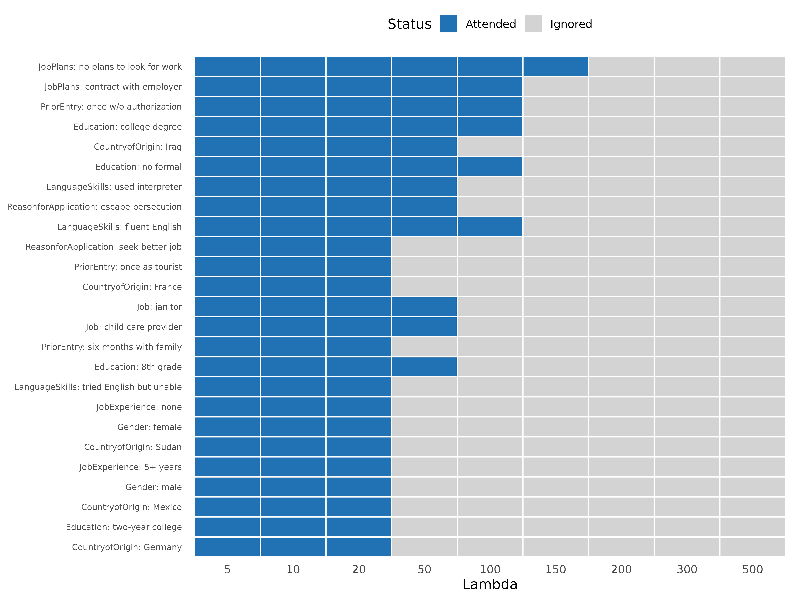

# CRT / HierNet: Which levels survive a strict signal-vs-noise test?

## When to use

Use `method = "crt"` when you want a hard *attendance test*: which
attribute levels keep a non-zero coefficient under increasing L1
penalty? Levels that vanish quickly under penalization are noise or
redundant; levels that survive the heaviest penalties genuinely drive
choices.

CRT requires the [hierNet](https://cran.r-project.org/package=hierNet)
package. It is the most computationally expensive method in cjdiag.

``` r

library(cjdiag)
data(immig)

f <- Chosen_Immigrant ~ Gender + Education + LanguageSkills +
  CountryofOrigin + Job + JobExperience + JobPlans +
  ReasonforApplication + PriorEntry
```

## Fit

``` r

crt <- cj_fit(f, data = immig, method = "crt",
              lambda_grid = c(5, 10, 20, 50, 100, 150, 200, 300, 500),
              n_folds = 3, n_perm = 5)
crt
#> Conjoint CRT/HierNet Model 
#> ========================== 
#> 
#> Optimal lambda: 5
#> Lambda (1-SE rule): 5
#> Accuracy: 64.8%
#> Observations: 2,000
#> Attributes: 9
#> Levels: 50
#> Attended levels: 50 / 50
#> 
#> Top 10 levels by MDA:
#> 
#> # A tibble: 10 × 5
#>     rank attribute            level                       mda max_lambda
#>    <int> <chr>                <chr>                     <dbl>      <dbl>
#>  1     1 JobPlans             no plans to look for work 4.14         150
#>  2     2 JobPlans             contract with employer    3.49         100
#>  3     3 PriorEntry           once w/o authorization    1.88         100
#>  4     4 Education            college degree            1.81         100
#>  5     5 CountryofOrigin      Iraq                      1.77          50
#>  6     6 Education            no formal                 1.57         100
#>  7     7 LanguageSkills       used interpreter          1.28          50
#>  8     8 ReasonforApplication escape persecution        1.27          50
#>  9     9 LanguageSkills       fluent English            1.27         100
#> 10    10 ReasonforApplication seek better job           0.910         20
```

`max_lambda` is the largest λ at which the level still has a non-zero
coefficient. `attended` is a boolean derived from `max_lambda > 0`.

Most signal-vs-noise separation happens between λ = 100 and λ = 500.
Stopping the grid at λ = 50 (or lower) is a common mistake that makes
nearly every level look “attended”: the penalty isn’t yet strong enough
to eliminate the noise. Always extend the grid past λ = 200; the package
default goes to 500.

## Plot lambda survival

``` r

plot(crt, type = "survival")
```



## Related

- [Marginal
  R-squared](https://dkarpa.github.io/cjdiag/articles/marginal_r2.md)
  for a per-respondent attendance signal.
- [Random Forest](https://dkarpa.github.io/cjdiag/articles/forest.md)
  for a non-parametric importance ranking (no penalization).
