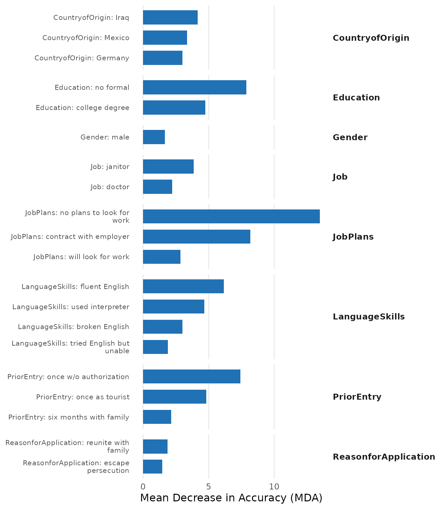
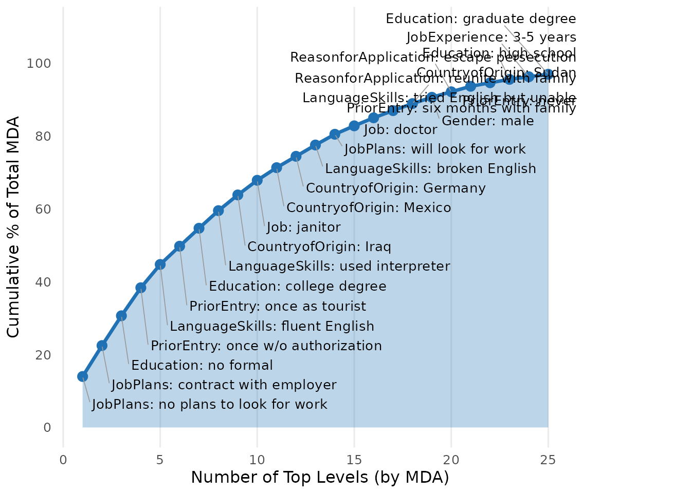
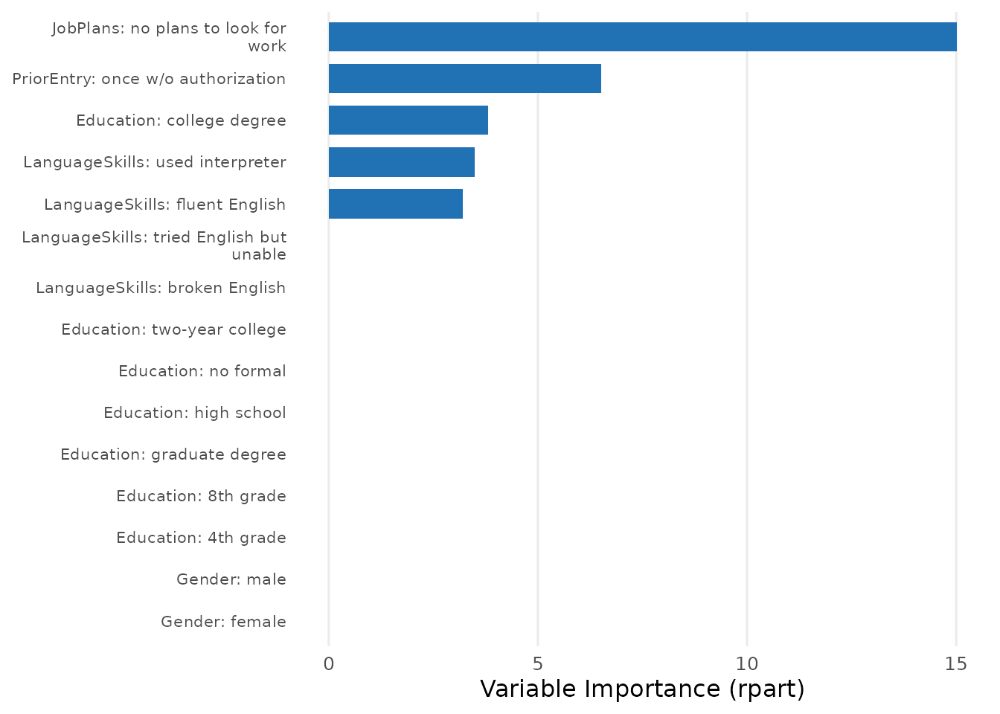

# Introduction to cjdiag

## Overview

**cjdiag** provides tools for attribute-level importance and attendance
in conjoint survey experiments — which attribute levels drive choices,
how they rank, and which ones respondents ignore. It offers 5 methods:

All methods share a common API:
[`cj_fit()`](https://dkarpa.github.io/cjdiag/reference/cj_fit.md) to
fit, [`print()`](https://rdrr.io/r/base/print.html) to view,
[`plot()`](https://rdrr.io/r/graphics/plot.default.html) to visualize,
and
[`importance()`](https://dkarpa.github.io/cjdiag/reference/importance.md)
to extract standardized results.

``` r
library(cjdiag)
data(immig)
```

## Quick Start with Random Forest

``` r
rf <- cj_fit(
  Chosen_Immigrant ~ Gender + Education + LanguageSkills +
    CountryofOrigin + Job + JobExperience + JobPlans +
    ReasonforApplication + PriorEntry,
  data = immig,
  method = "forest"
)

print(rf)
#> Conjoint Random Forest 
#> ====================== 
#> 
#> Resolution: levels
#> Trees: 500
#> OOB Error: 40.3%
#> Observations: 2,000
#> Attributes: 9
#> Levels: 50
#> 
#> Top 10 levels by MDA:
#> 
#> # A tibble: 10 × 5
#>     rank attribute       level                       mda root_pct
#>    <int> <chr>           <chr>                     <dbl>    <dbl>
#>  1     1 JobPlans        no plans to look for work 13.5      15.4
#>  2     2 JobPlans        contract with employer     8.18     11.2
#>  3     3 Education       no formal                  7.87      7.4
#>  4     4 PriorEntry      once w/o authorization     7.42     10.4
#>  5     5 LanguageSkills  fluent English             6.16      8.2
#>  6     6 PriorEntry      once as tourist            4.83      2.4
#>  7     7 Education       college degree             4.75      6.4
#>  8     8 LanguageSkills  used interpreter           4.66      5.6
#>  9     9 CountryofOrigin Iraq                       4.15      4.6
#> 10    10 Job             janitor                    3.87      3
```

### Plotting

The default importance plot shows Mean Decrease in Accuracy (MDA) for
each attribute level:

``` r
plot(rf)
```


### Customization

All plots support palette, font size, label, and theme customization:

``` r
plot(rf,
     palette = "colorblind",
     base_size = 14,
     attribute.names = c(LanguageSkills = "English Proficiency",
                         JobPlans = "Plans for Employment"),
     top_n = 15)
```


Group levels by attribute with visual separators:

``` r
plot(rf, group_by_attribute = TRUE, top_n = 20)
```



### Other Plot Types

``` r
plot(rf, type = "combined", top_n = 15)
```


``` r
plot(rf, type = "cumulative")
```


``` r
plot(rf, type = "cumulative_pct", top_n = 25)
```



## Decision Tree

Decision trees reveal the hierarchical structure of choices:

``` r
tr <- cj_fit(
  Chosen_Immigrant ~ Gender + Education + LanguageSkills +
    CountryofOrigin + Job + JobExperience + JobPlans +
    ReasonforApplication + PriorEntry,
  data = immig,
  method = "tree"
)

print(tr)
#> Conjoint Decision Tree 
#> ====================== 
#> 
#> Resolution: levels
#> Complexity (cp): 0.005
#> Root split: JobPlansno.plans.to.look.for.work
#> Depth: 4
#> Terminal nodes: 6
#> Observations: 2,000
#> Levels: 50
#> 
#> Top 10 levels by importance:
#> 
#> # A tibble: 10 × 4
#>     rank attribute      level                     importance
#>    <int> <chr>          <chr>                          <dbl>
#>  1     1 JobPlans       no plans to look for work      15.0 
#>  2     2 PriorEntry     once w/o authorization          6.51
#>  3     3 Education      college degree                  3.81
#>  4     4 LanguageSkills used interpreter                3.49
#>  5     5 LanguageSkills fluent English                  3.21
#>  6     6 Gender         female                          0   
#>  7     7 Gender         male                            0   
#>  8     8 Education      4th grade                       0   
#>  9     9 Education      8th grade                       0   
#> 10    10 Education      graduate degree                 0
```

``` r
plot(tr, type = "importance", top_n = 15)
```



## Importance Metrics

The
[`importance()`](https://dkarpa.github.io/cjdiag/reference/importance.md)
function returns a standardized results tibble from any model:

``` r
imp <- importance(rf)
print(imp)
#> Conjoint Importance Metrics 
#> =========================== 
#> 
#> Resolution: levels
#> Method: Random Forest (500 trees)
#> OOB Error: 40.3%
#> 
#> Level Importance (top 10 ):
#> 
#> # A tibble: 10 × 9
#>     rank attribute       level       mda   mdg root_pct class_0 class_1 var_name
#>    <int> <chr>           <chr>     <dbl> <dbl>    <dbl>   <dbl>   <dbl> <chr>   
#>  1     1 JobPlans        no plans… 13.5   28.2     15.4  12.3      7.25 JobPlan…
#>  2     2 JobPlans        contract…  8.18  23.0     11.2   3.70     6.98 JobPlan…
#>  3     3 Education       no formal  7.87  18.7      7.4   8.04     2.38 Educati…
#>  4     4 PriorEntry      once w/o…  7.42  22.9     10.4   6.87     3.66 PriorEn…
#>  5     5 LanguageSkills  fluent E…  6.16  22.3      8.2   2.71     6.00 Languag…
#>  6     6 PriorEntry      once as …  4.83  20.3      2.4   1.61     5.25 PriorEn…
#>  7     7 Education       college …  4.75  18.9      6.4   0.153    6.16 Educati…
#>  8     8 LanguageSkills  used int…  4.66  20.2      5.6   4.91     1.37 Languag…
#>  9     9 CountryofOrigin Iraq       4.15  17.1      4.6   3.53     2.15 Country…
#> 10    10 Job             janitor    3.87  18.0      3     2.09     3.36 Jobjani…
```

``` r
plot(imp)
```


## Global Options

Set defaults once and apply everywhere:

``` r
set_cjdiag_theme(palette = "colorblind", base_size = 13)
set_cjdiag_labels(
  attribute.names = c(
    LanguageSkills = "English Proficiency",
    JobPlans = "Plans for Employment"
  )
)

# Now all plots use colorblind palette and renamed attributes
plot(rf, top_n = 15)
```


## Method Overview

| Method        | [`cj_fit()`](https://dkarpa.github.io/cjdiag/reference/cj_fit.md) | Question Answered                                  |
|---------------|-------------------------------------------------------------------|----------------------------------------------------|
| Random Forest | `"forest"`                                                        | Which attributes matter most for choices?          |
| Decision Tree | `"tree"`                                                          | How do respondents structure their decisions?      |
| CRT/HierNet   | `"crt"`                                                           | Which attribute levels genuinely drive choices?    |
| Nested MM     | `"nmm"`                                                           | In what order do attributes settle choices?        |
| Marginal R-sq | `"marginal_r2"`                                                   | Which attributes did each respondent actually use? |
