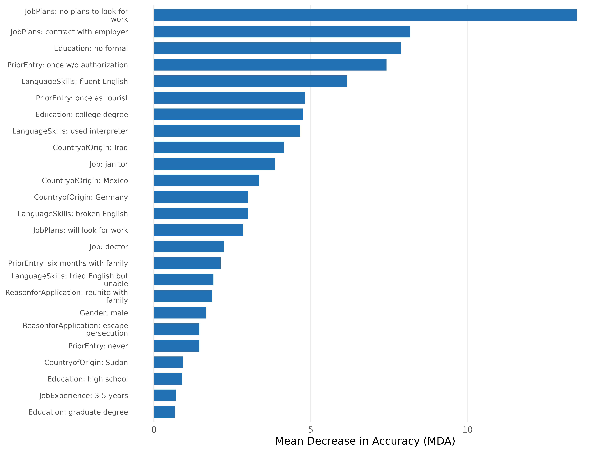
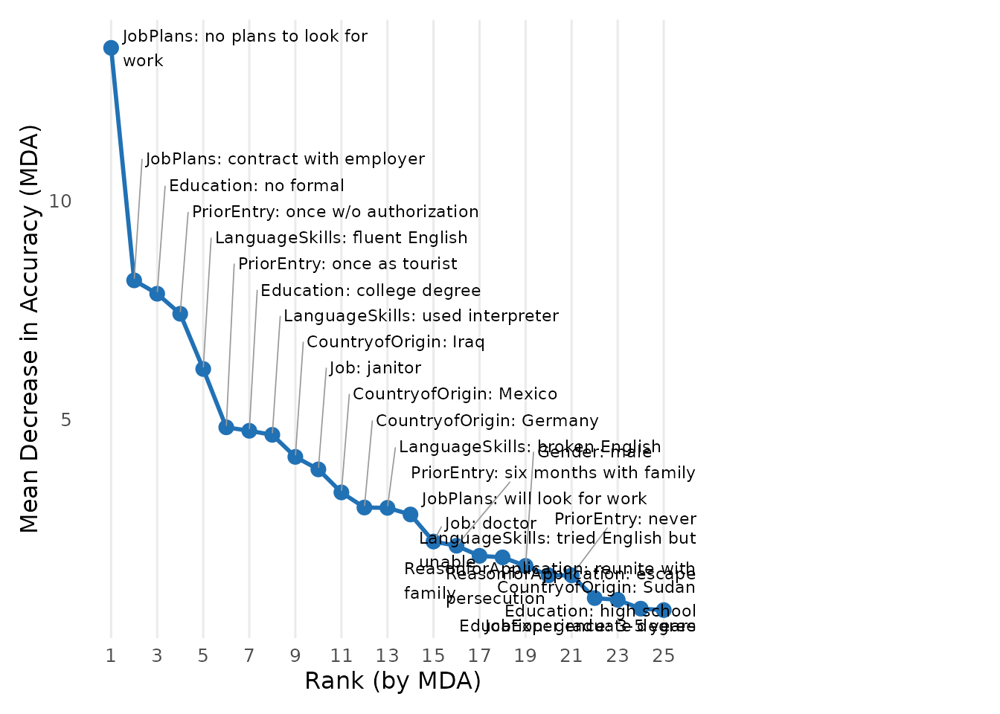
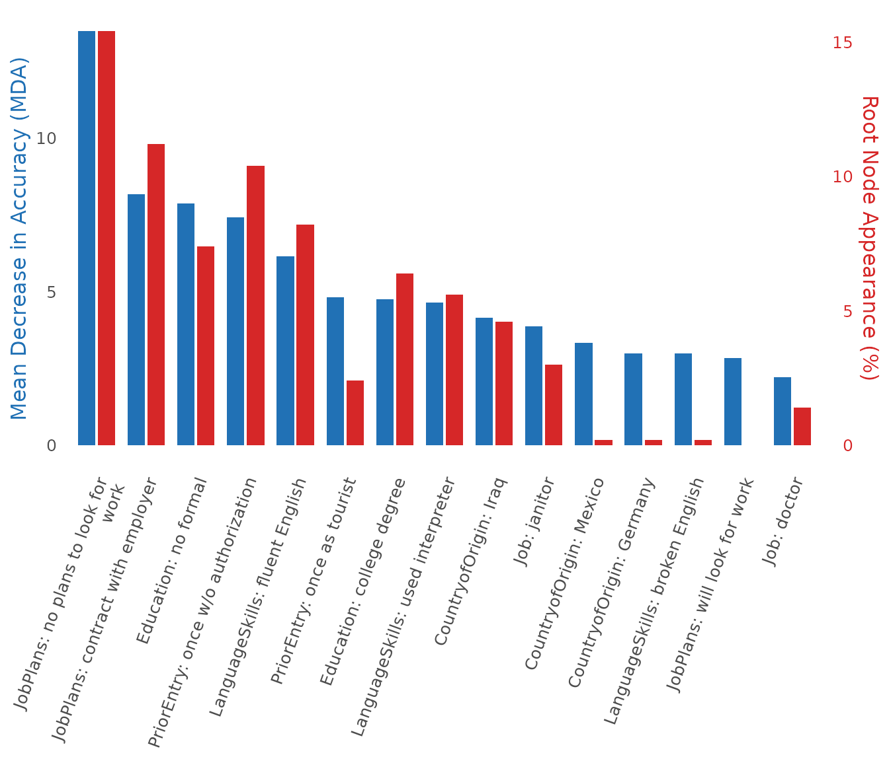
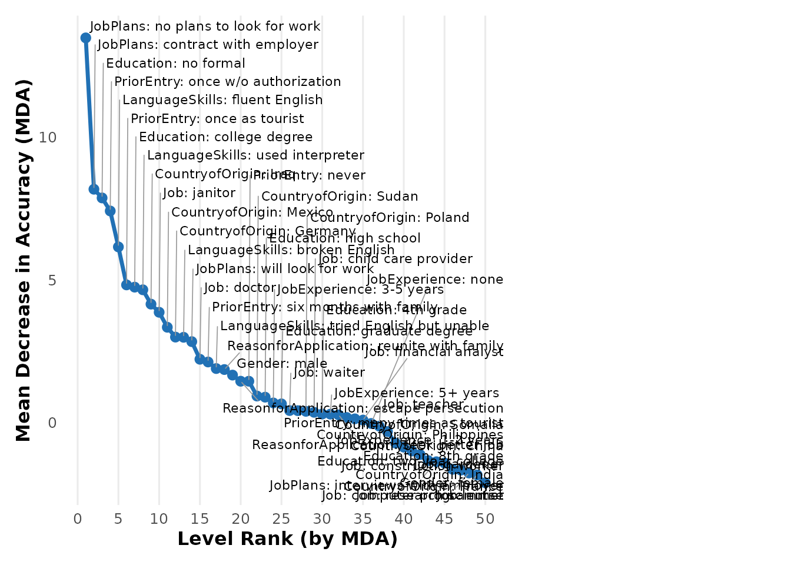
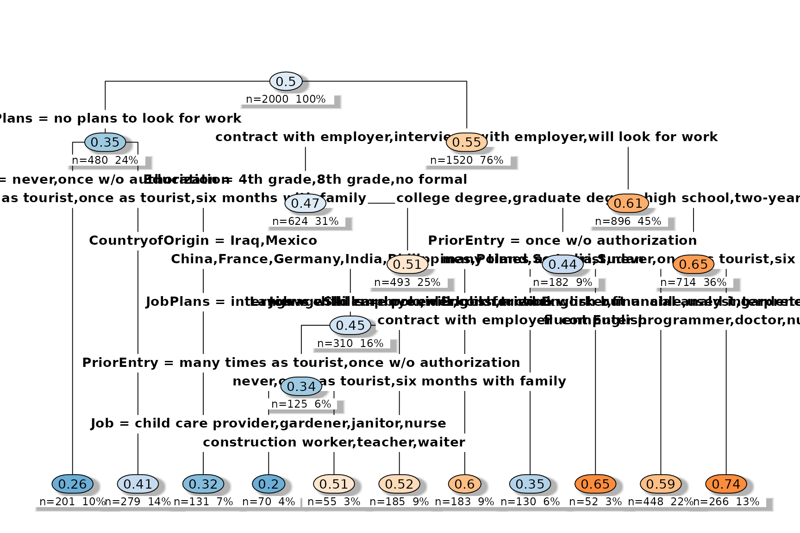
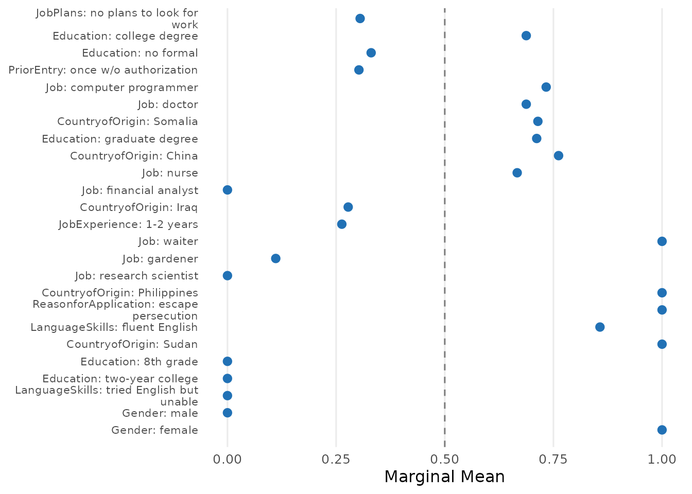
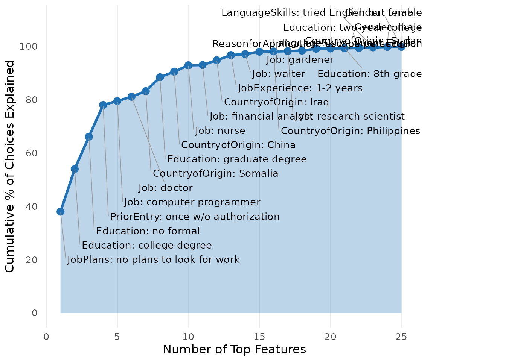
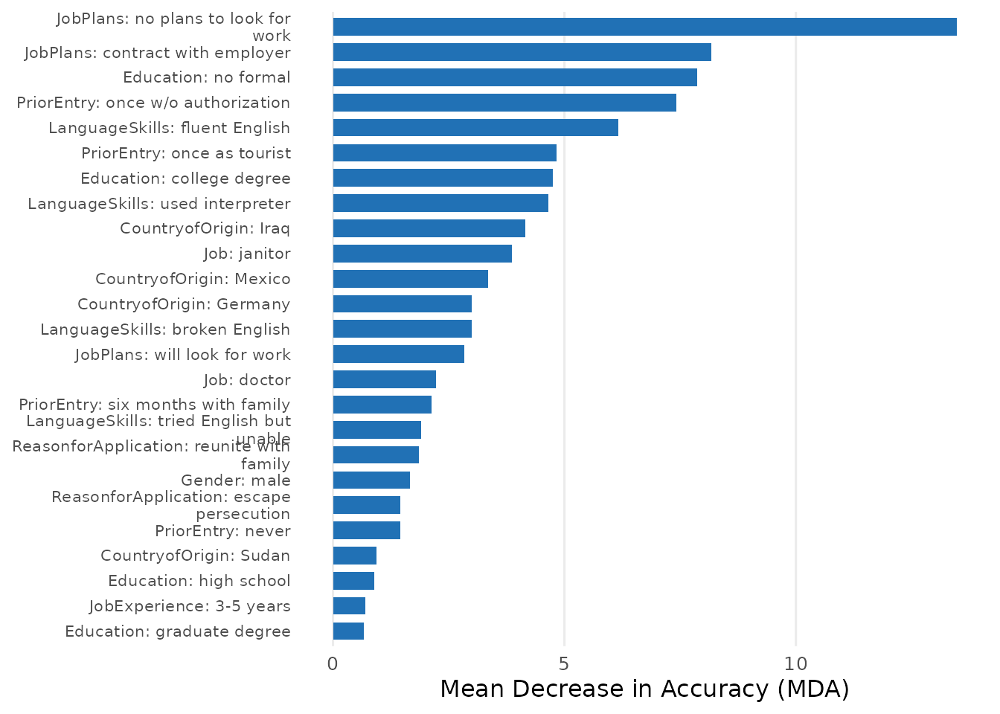
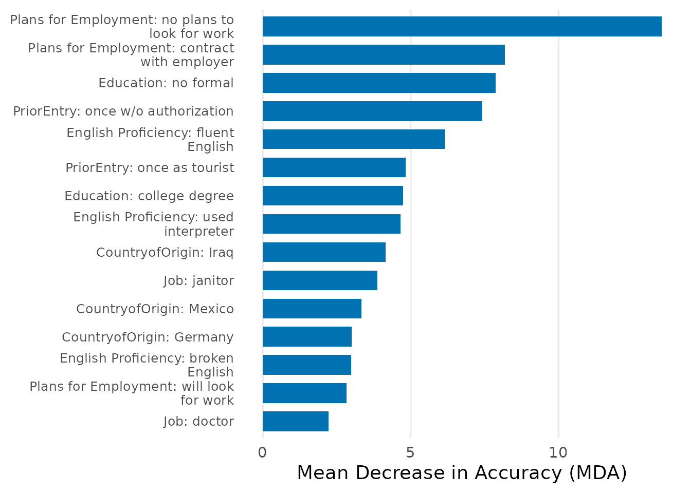
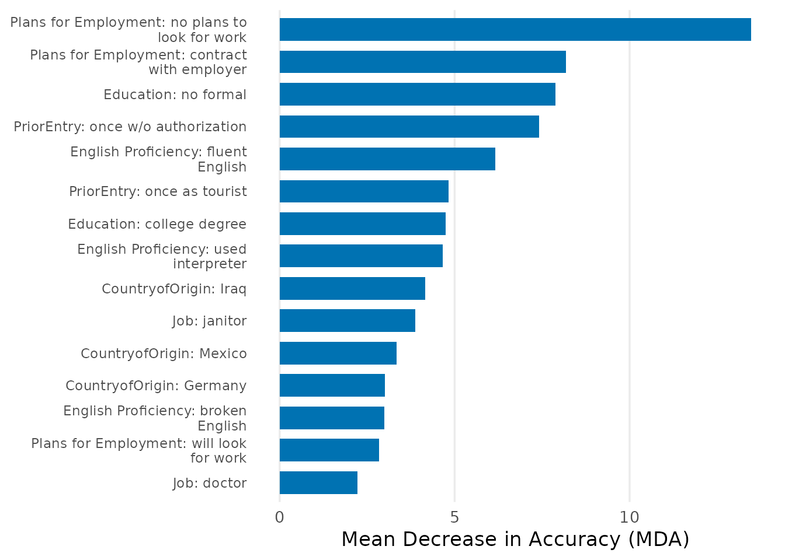

# Getting Started with cjdiag

## What cjdiag does

Standard conjoint analysis tools estimate Average Marginal Component
Effects (AMCEs) — the causal effect of changing a single attribute
level. AMCEs tell you *what* respondents prefer, but not *how* they
decide: which attributes they actually look at, which ones they ignore,
and in what order they process information.

**cjdiag** provides five methods that answer these diagnostic questions.
All share a common API:

    fit   <- cj_fit(formula, data, method = "...")
    print(fit)
    importance(fit)
    plot(fit)

We’ll walk through each method using the bundled immigration conjoint
dataset from Hainmueller & Hopkins (2015).

``` r
library(cjdiag)
data(immig)
```

The `immig` dataset contains 2,000 rows (one per profile) from ~1,400
respondents evaluating immigrant profiles on 9 attributes.

``` r
f <- Chosen_Immigrant ~ Gender + Education + LanguageSkills +
  CountryofOrigin + Job + JobExperience + JobPlans +
  ReasonforApplication + PriorEntry
```

## 1. Random Forest: Which attributes matter most?

Random forests measure how much each attribute level contributes to
predicting choices. The Mean Decrease in Accuracy (MDA) captures how
much worse predictions get when a level’s values are shuffled. The root
node rate tracks how often each level appears as the first split across
hundreds of trees — a proxy for which cue respondents check first.

``` r
rf <- cj_fit(f, data = immig, method = "forest")
rf
#> Conjoint Random Forest 
#> ====================== 
#> 
#> Resolution: levels
#> Trees: 500
#> OOB Error: 40.3%
#> Observations: 2,000
#> Attributes: 9
#> Levels: 50
#> 
#> Top 10 levels by MDA:
#> 
#> # A tibble: 10 × 5
#>     rank attribute       level                       mda root_pct
#>    <int> <chr>           <chr>                     <dbl>    <dbl>
#>  1     1 JobPlans        no plans to look for work 13.5      15.4
#>  2     2 JobPlans        contract with employer     8.18     11.2
#>  3     3 Education       no formal                  7.87      7.4
#>  4     4 PriorEntry      once w/o authorization     7.42     10.4
#>  5     5 LanguageSkills  fluent English             6.16      8.2
#>  6     6 PriorEntry      once as tourist            4.83      2.4
#>  7     7 Education       college degree             4.75      6.4
#>  8     8 LanguageSkills  used interpreter           4.66      5.6
#>  9     9 CountryofOrigin Iraq                       4.15      4.6
#> 10    10 Job             janitor                    3.87      3
```

### Importance plot

``` r
plot(rf, top_n = 20)
```



### Attribute ranking

``` r
plot(rf, type = "rank")
```



### Combined MDA + root node rate

``` r
plot(rf, type = "combined", top_n = 15)
```



### Cumulative importance

How many levels does it take to account for most of the total
importance?

``` r
plot(rf, type = "cumulative_pct", top_n = 25)
```



### Attribute-level resolution

Instead of individual levels, you can also measure importance at the
attribute level:

``` r
rf_attr <- cj_fit(f, data = immig, method = "forest", resolution = "attributes")
rf_attr
#> Conjoint Random Forest 
#> ====================== 
#> 
#> Resolution: attributes
#> Trees: 500
#> OOB Error: 40.2%
#> Observations: 2,000
#> Attributes: 9
#> 
#> Top 9 attributes by MDA:
#> 
#> # A tibble: 9 × 5
#>    rank attribute               mda   mdg root_pct
#>   <int> <chr>                 <dbl> <dbl>    <dbl>
#> 1     1 JobPlans             14.7    90.6     30.8
#> 2     2 LanguageSkills        6.13   86.4     13  
#> 3     3 PriorEntry            5.89  110.      14.4
#> 4     4 Job                   4.39  174.      14.4
#> 5     5 Education             4.36  133.      21.4
#> 6     6 CountryofOrigin       2.61  190.       4  
#> 7     7 ReasonforApplication  0.925  59.7      1.2
#> 8     8 Gender               -1.23   37.2      0  
#> 9     9 JobExperience        -1.68   93.6      0.8
```

## 2. Decision Tree: How are decisions structured?

A single classification tree reveals the hierarchical structure of
choices. The root split identifies the *gatekeeper* attribute — the one
that matters most. Deeper splits are conditional on earlier ones. Tree
depth indicates how many attributes are needed to explain most choices.

``` r
tr <- cj_fit(f, data = immig, method = "tree", resolution = "attributes")
tr
#> Conjoint Decision Tree 
#> ====================== 
#> 
#> Resolution: attributes
#> Complexity (cp): 0.005
#> Root split: JobPlans
#> Depth: 6
#> Terminal nodes: 11
#> Observations: 2,000
#> 
#> Top 7 attributes by importance:
#> 
#> # A tibble: 7 × 3
#>    rank attribute            importance
#>   <int> <chr>                     <dbl>
#> 1     1 JobPlans                17.7   
#> 2     2 PriorEntry              11.6   
#> 3     3 Education                7.39  
#> 4     4 Job                      6.88  
#> 5     5 CountryofOrigin          4.00  
#> 6     6 LanguageSkills           3.72  
#> 7     7 ReasonforApplication     0.0635
```

``` r
plot(tr)
```



## 3. Nested Marginal Means: In what order do attributes settle choices?

Nested marginal means (Dill, Howlett & Mueller-Crepon 2024) work through
attributes one at a time. At each step, the method identifies the
attribute level that most strongly tips choices away from 50/50 (the
most *decisive* level), then removes tasks where that level cannot
discriminate (because both profiles share it), and repeats. The result
is a sequential ranking of which attribute levels settle choices first.

``` r
nmm <- cj_fit(f, data = immig, method = "nmm", resp_id = "CaseID")
nmm
#> Conjoint Nested Marginal Means 
#> ============================== 
#> 
#> Observations: 2,000
#> Attributes: 9
#> Levels: 50
#> 
#> Total pairs: 1,000
#> After top 5: 205 (20.5% remaining)
#> 
#> Top 10 levels by decisiveness:
#> 
#> # A tibble: 10 × 6
#>     rank attribute       level                      mm decisiveness pct_of_total
#>    <int> <chr>           <chr>                   <dbl>        <dbl>        <dbl>
#>  1     1 JobPlans        no plans to look for w… 0.305        0.389         38  
#>  2     2 Education       college degree          0.687        0.375         16  
#>  3     3 Education       no formal               0.331        0.339         12.1
#>  4     4 PriorEntry      once w/o authorization  0.303        0.395         11.9
#>  5     5 Job             computer programmer     0.733        0.467          1.5
#>  6     6 Job             doctor                  0.688        0.375          1.6
#>  7     7 CountryofOrigin Somalia                 0.714        0.429          2.1
#>  8     8 Education       graduate degree         0.712        0.423          5.2
#>  9     9 CountryofOrigin China                   0.762        0.524          2.1
#> 10    10 Job             nurse                   0.667        0.333          2.4
```

### Decisiveness ranking

``` r
plot(nmm, type = "ranking")
```



### Cumulative explanatory power

``` r
plot(nmm, type = "cumulative")
```



## 4. Marginal R-squared: Which attributes did each respondent use?

For each individual respondent, marginal R-squared (Jenke et al. 2021)
measures how well each attribute alone explains their choices.
Respondents with R² = 0 for an attribute likely ignored it entirely.

``` r
mr2 <- cj_fit(f, data = immig, method = "marginal_r2", resp_id = "CaseID")
#> Warning in summary.lm(fit): essentially perfect fit: summary may be unreliable
#> Warning in summary.lm(fit): essentially perfect fit: summary may be unreliable
#> Warning in summary.lm(fit): essentially perfect fit: summary may be unreliable
#> Warning in summary.lm(fit): essentially perfect fit: summary may be unreliable
#> Warning in summary.lm(fit): essentially perfect fit: summary may be unreliable
#> Warning in summary.lm(fit): essentially perfect fit: summary may be unreliable
#> Warning in summary.lm(fit): essentially perfect fit: summary may be unreliable
#> Warning in summary.lm(fit): essentially perfect fit: summary may be unreliable
#> Warning in summary.lm(fit): essentially perfect fit: summary may be unreliable
#> Warning in summary.lm(fit): essentially perfect fit: summary may be unreliable
#> Warning in summary.lm(fit): essentially perfect fit: summary may be unreliable
#> Warning in summary.lm(fit): essentially perfect fit: summary may be unreliable
#> Warning in summary.lm(fit): essentially perfect fit: summary may be unreliable
#> Warning in summary.lm(fit): essentially perfect fit: summary may be unreliable
#> Warning in summary.lm(fit): essentially perfect fit: summary may be unreliable
#> Warning in summary.lm(fit): essentially perfect fit: summary may be unreliable
#> Warning in summary.lm(fit): essentially perfect fit: summary may be unreliable
#> Warning in summary.lm(fit): essentially perfect fit: summary may be unreliable
#> Warning in summary.lm(fit): essentially perfect fit: summary may be unreliable
#> Warning in summary.lm(fit): essentially perfect fit: summary may be unreliable
#> Warning in summary.lm(fit): essentially perfect fit: summary may be unreliable
#> Warning in summary.lm(fit): essentially perfect fit: summary may be unreliable
#> Warning in summary.lm(fit): essentially perfect fit: summary may be unreliable
#> Warning in summary.lm(fit): essentially perfect fit: summary may be unreliable
#> Warning in summary.lm(fit): essentially perfect fit: summary may be unreliable
#> Warning in summary.lm(fit): essentially perfect fit: summary may be unreliable
#> Warning in summary.lm(fit): essentially perfect fit: summary may be unreliable
#> Warning in summary.lm(fit): essentially perfect fit: summary may be unreliable
#> Warning in summary.lm(fit): essentially perfect fit: summary may be unreliable
#> Warning in summary.lm(fit): essentially perfect fit: summary may be unreliable
#> Warning in summary.lm(fit): essentially perfect fit: summary may be unreliable
#> Warning in summary.lm(fit): essentially perfect fit: summary may be unreliable
#> Warning in summary.lm(fit): essentially perfect fit: summary may be unreliable
#> Warning in summary.lm(fit): essentially perfect fit: summary may be unreliable
#> Warning in summary.lm(fit): essentially perfect fit: summary may be unreliable
#> Warning in summary.lm(fit): essentially perfect fit: summary may be unreliable
#> Warning in summary.lm(fit): essentially perfect fit: summary may be unreliable
#> Warning in summary.lm(fit): essentially perfect fit: summary may be unreliable
#> Warning in summary.lm(fit): essentially perfect fit: summary may be unreliable
#> Warning in summary.lm(fit): essentially perfect fit: summary may be unreliable
#> Warning in summary.lm(fit): essentially perfect fit: summary may be unreliable
#> Warning in summary.lm(fit): essentially perfect fit: summary may be unreliable
#> Warning in summary.lm(fit): essentially perfect fit: summary may be unreliable
#> Warning in summary.lm(fit): essentially perfect fit: summary may be unreliable
mr2
#> Conjoint Marginal R-squared Importance (Jenke et al. 2021) 
#> ========================================================== 
#> 
#> Resolution: levels
#> Respondents: 200
#> Observations: 2,000
#> Attributes: 9 (50 levels)
#> 
#> Top 10 levels by mean absolute coefficient:
#> 
#> # A tibble: 10 × 7
#>     rank attribute       level      mean_coef mean_abs_coef sd_coef attr_mean_r2
#>    <int> <chr>           <chr>          <dbl>         <dbl>   <dbl>        <dbl>
#>  1     1 Job             research …   0.161           0.637   0.743        0.194
#>  2     2 Job             construct…   0.0384          0.603   0.699        0.194
#>  3     3 CountryofOrigin France       0.0519          0.574   0.703        0.193
#>  4     4 CountryofOrigin India        0.00745         0.567   0.689        0.193
#>  5     5 Job             teacher      0.116           0.553   0.653        0.194
#>  6     6 CountryofOrigin Poland       0.00940         0.547   0.673        0.193
#>  7     7 Job             janitor     -0.123           0.547   0.650        0.194
#>  8     8 Job             doctor       0.126           0.540   0.670        0.194
#>  9     9 CountryofOrigin Somalia      0.0603          0.538   0.667        0.193
#> 10    10 CountryofOrigin Germany      0.0108          0.537   0.665        0.193
```

## 5. CRT/HierNet: Which levels genuinely drive choices?

CRT applies increasing statistical penalty (L1 regularization via
hierNet) to strip away weak signals. Levels that keep their effect even
under heavy penalization genuinely drive choices; levels that vanish
quickly are noise or redundant. Requires the
[hierNet](https://cran.r-project.org/package=hierNet) package.

``` r
crt <- cj_fit(f, data = immig, method = "crt",
              lambda_grid = c(5, 10, 20, 50), n_folds = 3, n_perm = 5)
crt
#> Conjoint CRT/HierNet Model 
#> ========================== 
#> 
#> Optimal lambda: 5
#> Lambda (1-SE rule): 5
#> Accuracy: 64.8%
#> Observations: 2,000
#> Attributes: 9
#> Levels: 50
#> Attended levels: 50 / 50
#> 
#> Top 10 levels by MDA:
#> 
#> # A tibble: 10 × 5
#>     rank attribute            level                       mda max_lambda
#>    <int> <chr>                <chr>                     <dbl>      <dbl>
#>  1     1 JobPlans             no plans to look for work 4.14          50
#>  2     2 JobPlans             contract with employer    3.49          50
#>  3     3 PriorEntry           once w/o authorization    1.88          50
#>  4     4 Education            college degree            1.81          50
#>  5     5 CountryofOrigin      Iraq                      1.77          50
#>  6     6 Education            no formal                 1.57          50
#>  7     7 LanguageSkills       used interpreter          1.28          50
#>  8     8 ReasonforApplication escape persecution        1.27          50
#>  9     9 LanguageSkills       fluent English            1.27          50
#> 10    10 ReasonforApplication seek better job           0.910         20
```

## Extracting results

The
[`importance()`](https://dkarpa.github.io/cjdiag/reference/importance.md)
function returns a standardized tibble from any model, making it easy to
compare across methods:

``` r
imp <- importance(rf)
imp
#> Conjoint Importance Metrics 
#> =========================== 
#> 
#> Resolution: levels
#> Method: Random Forest (500 trees)
#> OOB Error: 40.3%
#> 
#> Level Importance (top 10 ):
#> 
#> # A tibble: 10 × 9
#>     rank attribute       level       mda   mdg root_pct class_0 class_1 var_name
#>    <int> <chr>           <chr>     <dbl> <dbl>    <dbl>   <dbl>   <dbl> <chr>   
#>  1     1 JobPlans        no plans… 13.5   28.2     15.4  12.3      7.25 JobPlan…
#>  2     2 JobPlans        contract…  8.18  23.0     11.2   3.70     6.98 JobPlan…
#>  3     3 Education       no formal  7.87  18.7      7.4   8.04     2.38 Educati…
#>  4     4 PriorEntry      once w/o…  7.42  22.9     10.4   6.87     3.66 PriorEn…
#>  5     5 LanguageSkills  fluent E…  6.16  22.3      8.2   2.71     6.00 Languag…
#>  6     6 PriorEntry      once as …  4.83  20.3      2.4   1.61     5.25 PriorEn…
#>  7     7 Education       college …  4.75  18.9      6.4   0.153    6.16 Educati…
#>  8     8 LanguageSkills  used int…  4.66  20.2      5.6   4.91     1.37 Languag…
#>  9     9 CountryofOrigin Iraq       4.15  17.1      4.6   3.53     2.15 Country…
#> 10    10 Job             janitor    3.87  18.0      3     2.09     3.36 Jobjani…
```

``` r
plot(imp)
```



Results can also be converted to a data frame for further analysis:

``` r
head(as.data.frame(imp))
#>   rank      attribute                     level       mda      mdg root_pct
#> 1    1       JobPlans no plans to look for work 13.478845 28.16033     15.4
#> 2    2       JobPlans    contract with employer  8.177931 22.97810     11.2
#> 3    3      Education                 no formal  7.872982 18.74837      7.4
#> 4    4     PriorEntry    once w/o authorization  7.416027 22.91502     10.4
#> 5    5 LanguageSkills            fluent English  6.157514 22.27571      8.2
#> 6    6     PriorEntry           once as tourist  4.827218 20.27154      2.4
#>     class_0  class_1                          var_name
#> 1 12.333363 7.250195 JobPlansno.plans.to.look.for.work
#> 2  3.697133 6.978693    JobPlanscontract.with.employer
#> 3  8.035186 2.376082                Educationno.formal
#> 4  6.870653 3.664381  PriorEntryonce.w.o.authorization
#> 5  2.712916 6.002354      LanguageSkillsfluent.English
#> 6  1.607777 5.250203         PriorEntryonce.as.tourist
```

If [broom](https://cran.r-project.org/package=broom) is installed,
`tidy()` and `glance()` also work:

``` r
generics::tidy(rf)
#> # A tibble: 50 × 9
#>     rank attribute       level       mda   mdg root_pct class_0 class_1 var_name
#>    <int> <chr>           <chr>     <dbl> <dbl>    <dbl>   <dbl>   <dbl> <chr>   
#>  1     1 JobPlans        no plans… 13.5   28.2     15.4  12.3      7.25 JobPlan…
#>  2     2 JobPlans        contract…  8.18  23.0     11.2   3.70     6.98 JobPlan…
#>  3     3 Education       no formal  7.87  18.7      7.4   8.04     2.38 Educati…
#>  4     4 PriorEntry      once w/o…  7.42  22.9     10.4   6.87     3.66 PriorEn…
#>  5     5 LanguageSkills  fluent E…  6.16  22.3      8.2   2.71     6.00 Languag…
#>  6     6 PriorEntry      once as …  4.83  20.3      2.4   1.61     5.25 PriorEn…
#>  7     7 Education       college …  4.75  18.9      6.4   0.153    6.16 Educati…
#>  8     8 LanguageSkills  used int…  4.66  20.2      5.6   4.91     1.37 Languag…
#>  9     9 CountryofOrigin Iraq       4.15  17.1      4.6   3.53     2.15 Country…
#> 10    10 Job             janitor    3.87  18.0      3     2.09     3.36 Jobjani…
#> # ℹ 40 more rows
generics::glance(rf)
#> # A tibble: 1 × 6
#>   method        n_obs ntree oob_error n_attributes n_levels
#>   <chr>         <int> <int>     <dbl>        <int>    <int>
#> 1 cjdiag_forest  2000   500     0.403            9       50
```

## Plot customization

All plot methods return ggplot2 objects and accept these parameters:

- `palette`: `"default"`, `"colorblind"` (Okabe-Ito), or `"grey"`
- `base_size`: Font size (passed to theme)
- `label_wrap`: Character width for label wrapping
- `attribute.names`: Named vector to rename attributes in display
- `level.names`: Named vector to rename levels
- `theme`: A full ggplot2 theme object

``` r
plot(rf,
     palette = "colorblind",
     base_size = 14,
     attribute.names = c(LanguageSkills = "English Proficiency",
                         JobPlans = "Plans for Employment"),
     top_n = 15)
```



### Global defaults

Set defaults once and apply everywhere:

``` r
set_cjdiag_theme(palette = "colorblind", base_size = 13)
set_cjdiag_labels(
  attribute.names = c(
    LanguageSkills = "English Proficiency",
    JobPlans = "Plans for Employment"
  )
)

# All subsequent plots use these defaults
plot(rf, top_n = 15)
```



## Method summary

| Method        | [`cj_fit()`](https://dkarpa.github.io/cjdiag/reference/cj_fit.md) | Question                                    | Key output                   |
|---------------|-------------------------------------------------------------------|---------------------------------------------|------------------------------|
| Random Forest | `"forest"`                                                        | Which attributes matter most?               | MDA ranking, root node rates |
| Decision Tree | `"tree"`                                                          | How are decisions structured?               | Tree splits, gatekeeper      |
| Nested MM     | `"nmm"`                                                           | In what order do attributes settle choices? | Decisiveness ranking         |
| Marginal R-sq | `"marginal_r2"`                                                   | Which attributes did each respondent use?   | Per-respondent R²            |
| CRT/HierNet   | `"crt"`                                                           | Which levels genuinely drive choices?       | Lambda survival path         |
