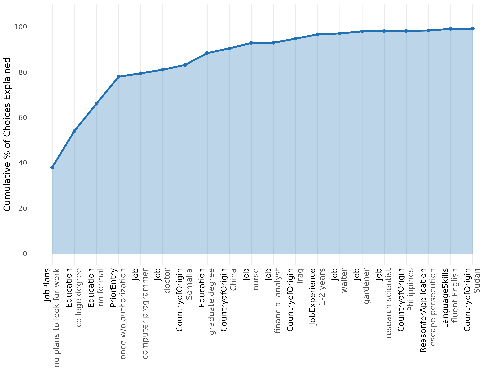

# Nested Marginal Means: In what order do levels settle choices?

## When to use

Use `method = "nmm"` (Dill, Howlett & Mueller-Crepon 2024) when you care
about the *order* in which attribute levels settle choices, not just
their static importance. NMM is the closest match to elimination-
by-aspects (Tversky 1972) at the level of attribute levels.

The procedure works sequentially:

1.  Identify the level whose marginal mean deviates most from 50/50 —
    the most *decisive* level.
2.  Remove choice tasks where that level cannot discriminate (because
    both profiles share it).
3.  Repeat on the reduced sample.

The cumulative plot shows how quickly the top levels account for the
total decisiveness.

``` r

library(cjdiag)
data(immig)

f <- Chosen_Immigrant ~ Gender + Education + LanguageSkills +
  CountryofOrigin + Job + JobExperience + JobPlans +
  ReasonforApplication + PriorEntry
```

## Fit

``` r

nmm <- cj_fit(f, data = immig, method = "nmm",
              resp_id = "CaseID", n_boot = 0)
nmm
#> Conjoint Nested Marginal Means 
#> ============================== 
#> 
#> Observations: 2,000
#> Attributes: 9
#> Levels: 50
#> 
#> Total pairs: 1,000
#> After top 5: 205 (20.5% remaining)
#> 
#> Top 10 levels by decisiveness:
#> 
#> # A tibble: 10 × 6
#>     rank attribute       level                      mm decisiveness pct_of_total
#>    <int> <chr>           <chr>                   <dbl>        <dbl>        <dbl>
#>  1     1 JobPlans        no plans to look for w… 0.305        0.389         38  
#>  2     2 Education       college degree          0.687        0.375         16  
#>  3     3 Education       no formal               0.331        0.339         12.1
#>  4     4 PriorEntry      once w/o authorization  0.303        0.395         11.9
#>  5     5 Job             computer programmer     0.733        0.467          1.5
#>  6     6 Job             doctor                  0.688        0.375          1.6
#>  7     7 CountryofOrigin Somalia                 0.714        0.429          2.1
#>  8     8 Education       graduate degree         0.712        0.423          5.2
#>  9     9 CountryofOrigin China                   0.762        0.524          2.1
#> 10    10 Job             nurse                   0.667        0.333          2.4
```

## Plot the cumulative explanation curve

``` r

plot(nmm, top_n = 20)
```



A steep early curve = a strong decision-order hierarchy: a few
top-ranked levels settle most of the choices. A flat curve =
compensatory processing, where many levels each contribute a little.

## Related

- [Decision Tree](https://dkarpa.github.io/cjdiag/articles/tree.md) for
  an alternative hierarchical representation that uses CART splits
  instead of marginal means.
- [Random Forest](https://dkarpa.github.io/cjdiag/articles/forest.md)
  for static level importance without an ordering assumption.
