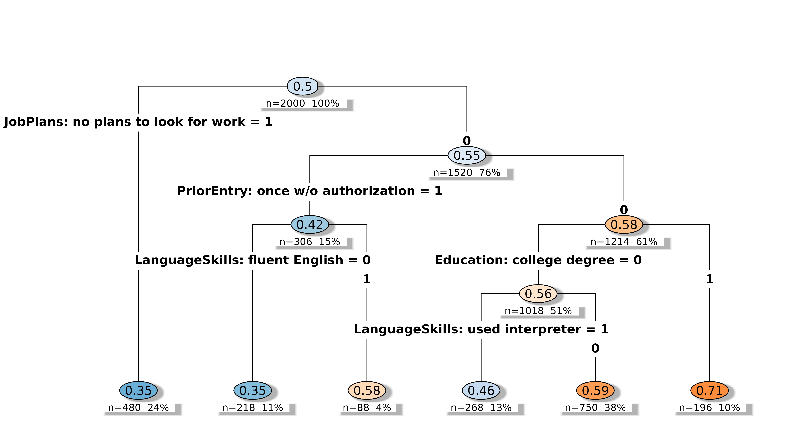

# Decision Tree: How do respondents structure their decisions?

## When to use

Use `method = "tree"` when you suspect respondents apply a hierarchical
elimination rule — a lexicographic *gatekeeper* attribute they check
first, then a smaller cue conditional on it. The root split identifies
the gatekeeper. The tree uses only a subset of available levels,
consistent with respondents processing a few key cues rather than all
information at once.

``` r

library(cjdiag)
data(immig)

f <- Chosen_Immigrant ~ Gender + Education + LanguageSkills +
  CountryofOrigin + Job + JobExperience + JobPlans +
  ReasonforApplication + PriorEntry
```

## Fit

``` r

tr <- cj_fit(f, data = immig, method = "tree")
tr
#> Conjoint Decision Tree 
#> ====================== 
#> 
#> Resolution: levels
#> Complexity (cp): 0.005
#> Root split: JobPlansno.plans.to.look.for.work
#> Depth: 4
#> Terminal nodes: 6
#> Observations: 2,000
#> Levels: 50
#> 
#> Top 10 levels by importance:
#> 
#> # A tibble: 10 × 4
#>     rank attribute      level                     importance
#>    <int> <chr>          <chr>                          <dbl>
#>  1     1 JobPlans       no plans to look for work      15.0 
#>  2     2 PriorEntry     once w/o authorization          6.51
#>  3     3 Education      college degree                  3.81
#>  4     4 LanguageSkills used interpreter                3.49
#>  5     5 LanguageSkills fluent English                  3.21
#>  6     6 Gender         female                          0   
#>  7     7 Gender         male                            0   
#>  8     8 Education      4th grade                       0   
#>  9     9 Education      8th grade                       0   
#> 10    10 Education      graduate degree                 0
```

## Plot

``` r

plot(tr)
```



Splits are labelled `Attribute: level`
(e.g. `JobPlans: no plans to look for work`) so the diagnostic is
readable without per-dataset customisation.

## Related

- [Random Forest](https://dkarpa.github.io/cjdiag/articles/forest.md)
  gives the population-level importance hierarchy that the tree’s splits
  draw from.
- [Nested Marginal
  Means](https://dkarpa.github.io/cjdiag/articles/nmm.md) for an
  alternative sequential-elimination view that does not require fitting
  a tree.
