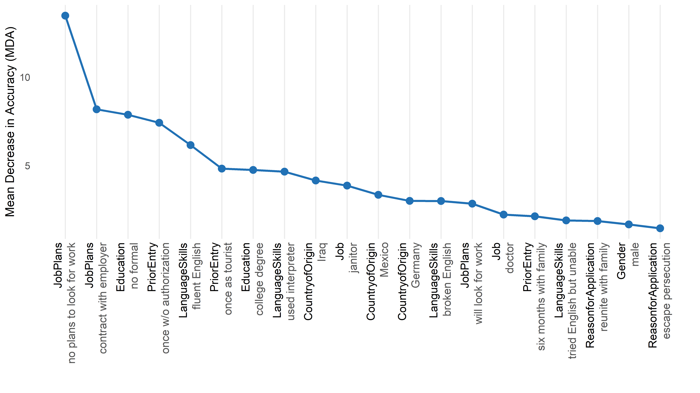
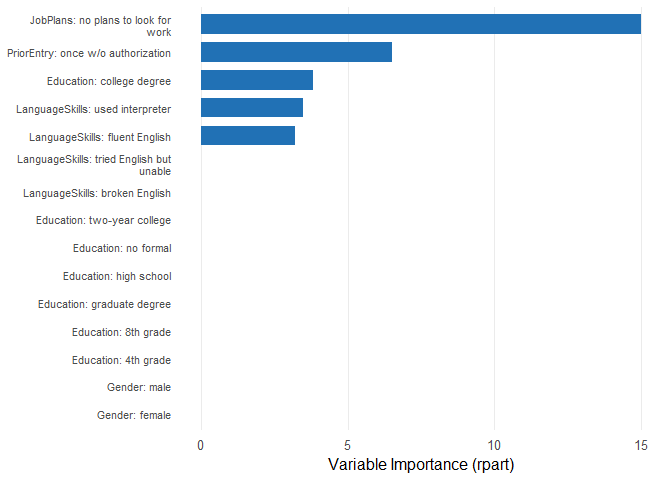
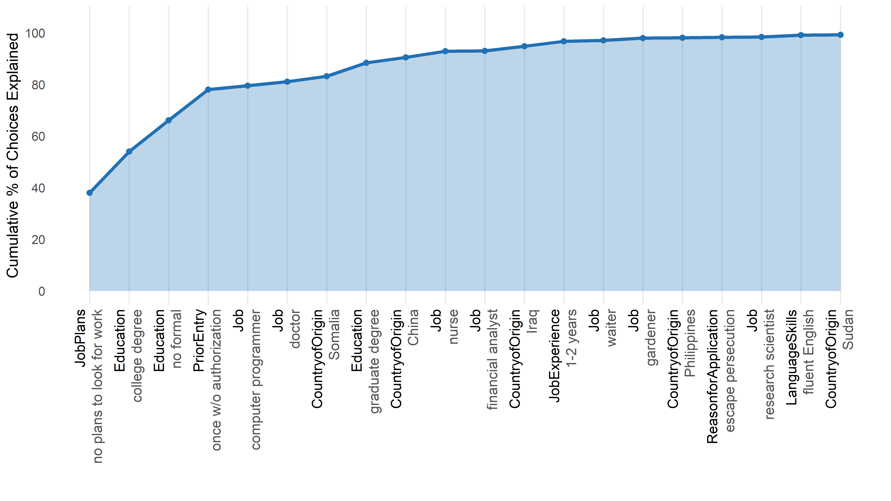

# cjdiag

Tools for attribute-level importance and attendance in conjoint survey
experiments — which attribute levels drive choices, how they rank, and
which ones respondents ignore.

## Why cjdiag?

Standard conjoint analysis tools
([cjoint](https://cran.r-project.org/package=cjoint),
[cregg](https://github.com/leeper/cregg)) estimate *what* respondents
prefer — Average Marginal Component Effects (AMCEs) and marginal means.
But they cannot tell you *how* respondents decide: which attributes they
actually attend to or which attribute levels they ignore entirely.

**cjdiag** fills this gap with five diagnostic methods that reveal the
decision process behind conjoint choices.

## Installation

``` r

# Install from GitHub (CRAN submission pending)
# install.packages("pak")
pak::pak("dkarpa/cjdiag")
```

## Quick Start

``` r

library(cjdiag)
data(immig)

rf <- cj_fit(
  Chosen_Immigrant ~ Gender + Education + LanguageSkills +
    CountryofOrigin + Job + JobExperience + JobPlans +
    ReasonforApplication + PriorEntry,
  data = immig,
  method = "forest"
)

rf
#> Conjoint Random Forest 
#> ====================== 
#> 
#> Resolution: levels
#> Trees: 500
#> OOB Error: 40.3%
#> Observations: 2,000
#> Attributes: 9
#> Levels: 50
#> 
#> Top 10 levels by MDA:
#> 
#> # A tibble: 10 × 7
#>     rank attribute       level                      mda root_pct class_0 class_1
#>    <int> <chr>           <chr>                    <dbl>    <dbl>   <dbl>   <dbl>
#>  1     1 JobPlans        no plans to look for wo… 13.5      15.4  12.3      7.25
#>  2     2 JobPlans        contract with employer    8.18     11.2   3.70     6.98
#>  3     3 Education       no formal                 7.87      7.4   8.04     2.38
#>  4     4 PriorEntry      once w/o authorization    7.42     10.4   6.87     3.66
#>  5     5 LanguageSkills  fluent English            6.16      8.2   2.71     6.00
#>  6     6 PriorEntry      once as tourist           4.83      2.4   1.61     5.25
#>  7     7 Education       college degree            4.75      6.4   0.153    6.16
#>  8     8 LanguageSkills  used interpreter          4.66      5.6   4.91     1.37
#>  9     9 CountryofOrigin Iraq                      4.15      4.6   3.53     2.15
#> 10    10 Job             janitor                   3.87      3     2.09     3.36
```

The full results table is the main output. Each row is one attribute
level. The columns:

- **rank** — position in the importance ordering. Rank 1 = the level
  that does the most work in driving choices.
- **attribute** — the conjoint attribute (the question the level
  answers, e.g. *what is this immigrant’s reason for applying?*).
- **level** — the specific value of that attribute (e.g. *escape
  persecution*).
- **mda** — *Mean Decrease in Accuracy*. How much the forest’s
  predictive accuracy drops when the information in this level is
  shuffled away. Higher = this level genuinely shapes choices. Levels
  with `mda` near zero are effectively ignored.
- **root_pct** — % of trees in the forest where this level is the
  *first* split. A high value means respondents tend to *start* their
  decision by checking this level. This is the **gatekeeper signal**.
- **class_0** — how strongly this level pushes respondents to *reject* a
  profile. A “veto” signal.
- **class_1** — how strongly this level pushes them to *select* a
  profile. An “attractor” signal.

The asymmetry between `class_0` and `class_1` reveals **direction**.
`class_0 ≫ class_1` means the level is a deal-breaker (e.g. *no plans to
look for work* mostly causes rejection). `class_1 ≫ class_0` means the
level is a draw (e.g. *fluent English* mostly causes selection).

``` r

knitr::kable(
  head(rf$results, 20)[, c("rank", "attribute", "level", "mda",
                           "root_pct", "class_0", "class_1")],
  digits = 2
)
```

| rank | attribute | level | mda | root_pct | class_0 | class_1 |
|---:|:---|:---|---:|---:|---:|---:|
| 1 | JobPlans | no plans to look for work | 13.48 | 15.4 | 12.33 | 7.25 |
| 2 | JobPlans | contract with employer | 8.18 | 11.2 | 3.70 | 6.98 |
| 3 | Education | no formal | 7.87 | 7.4 | 8.04 | 2.38 |
| 4 | PriorEntry | once w/o authorization | 7.42 | 10.4 | 6.87 | 3.66 |
| 5 | LanguageSkills | fluent English | 6.16 | 8.2 | 2.71 | 6.00 |
| 6 | PriorEntry | once as tourist | 4.83 | 2.4 | 1.61 | 5.25 |
| 7 | Education | college degree | 4.75 | 6.4 | 0.15 | 6.16 |
| 8 | LanguageSkills | used interpreter | 4.66 | 5.6 | 4.91 | 1.37 |
| 9 | CountryofOrigin | Iraq | 4.15 | 4.6 | 3.53 | 2.15 |
| 10 | Job | janitor | 3.87 | 3.0 | 2.09 | 3.36 |
| 11 | CountryofOrigin | Mexico | 3.34 | 0.2 | 1.41 | 3.47 |
| 12 | CountryofOrigin | Germany | 3.00 | 0.2 | 3.24 | 1.05 |
| 13 | LanguageSkills | broken English | 2.99 | 0.2 | -0.38 | 4.60 |
| 14 | JobPlans | will look for work | 2.84 | 0.0 | 2.04 | 1.55 |
| 15 | Job | doctor | 2.22 | 1.4 | 2.26 | 0.93 |
| 16 | PriorEntry | six months with family | 2.13 | 1.4 | 0.58 | 2.29 |
| 17 | LanguageSkills | tried English but unable | 1.90 | 0.4 | 2.28 | 0.26 |
| 18 | ReasonforApplication | reunite with family | 1.86 | 0.2 | 0.04 | 2.58 |
| 19 | Gender | male | 1.67 | 0.6 | 0.56 | 1.86 |
| 20 | ReasonforApplication | escape persecution | 1.45 | 1.0 | -2.40 | 4.24 |

### Importance by Rank

``` r

plot(rf, type = "rank", top_n = 20)
```



### Decision Tree

``` r

tr <- cj_fit(
  Chosen_Immigrant ~ Gender + Education + LanguageSkills +
    CountryofOrigin + Job + JobExperience + JobPlans +
    ReasonforApplication + PriorEntry,
  data = immig,
  method = "tree"
)

plot(tr)
```



### Nested Marginal Means

``` r

nmm <- cj_fit(
  Chosen_Immigrant ~ Gender + Education + LanguageSkills +
    CountryofOrigin + Job + JobExperience + JobPlans +
    ReasonforApplication + PriorEntry,
  data = immig,
  method = "nmm",
  resp_id = "CaseID",
  n_boot = 0
)

plot(nmm, type = "cumulative", top_n = 20)
```



## Methods

All methods are accessed through a single function:
`cj_fit(formula, data, method)`.

| Estimand | `method =` | Question | Output | Behavioural assumption | When to use |
|----|----|----|----|----|----|
| **Level importance** | `"forest"` | Which attribute levels matter most? | MDA, root-split rate per level | None — non-parametric | Default. Always fit this first. |
| **Decision structure** | `"tree"` | How do respondents structure their decisions? | Hierarchical CART splits | Lexicographic / sequential | When you suspect a gatekeeper. |
| **Level attendance** | `"crt"` | Which levels survive a strict signal-vs-noise test? | Lambda-survival, attended/ignored | Sparsity (most levels are noise) | When you want a hard attendance test. |
| **Decision order** | `"nmm"` | In what order do levels settle choices? | Decisiveness ranking, cumulative % | Sequential elimination (EBA) | When you care about the decision *order*. |
| **Individual attendance** | `"marginal_r2"` | Which attributes did each respondent actually use? | Per-respondent R² matrix | Per-respondent simple-regression fit | When you want individual-level heterogeneity. |

## Plot Customization

All plot methods return ggplot2 objects and accept customization
parameters:

``` r

# Colorblind-safe palette
plot(rf, palette = "colorblind")

# Rename attributes in display
plot(rf, attribute.names = c(LanguageSkills = "English Proficiency"))

# Full ggplot2 theme override
plot(rf, theme = ggplot2::theme_classic(base_size = 14))
```

Three palettes available: `"default"`, `"colorblind"` (Okabe-Ito),
`"grey"`.

Set defaults once with
[`set_cjdiag_theme()`](https://dkarpa.github.io/cjdiag/reference/set_cjdiag_theme.md)
and
[`set_cjdiag_labels()`](https://dkarpa.github.io/cjdiag/reference/set_cjdiag_labels.md).

## Related Packages

**cjdiag** is complementary to packages that estimate AMCEs and design
conjoint experiments:

- [cjoint](https://cran.r-project.org/package=cjoint) — AMCE estimation
  (Hainmueller, Hopkins & Yamamoto)
- [cregg](https://github.com/leeper/cregg) — AMCE and marginal means
  with tidy output
- [projoint](https://cran.r-project.org/package=projoint) — full
  conjoint pipeline
- [cbcTools](https://cran.r-project.org/package=cbcTools) — conjoint
  experiment design and power analysis

Run cjoint or cregg for AMCEs, then cjdiag to diagnose how respondents
actually made those choices.

## Getting Started

For a full walkthrough, see the [Getting Started
vignette](https://dkarpa.github.io/cjdiag/articles/cjdiag.html). Each
method has its own task-oriented vignette:
[forest](https://dkarpa.github.io/cjdiag/articles/forest.html),
[tree](https://dkarpa.github.io/cjdiag/articles/tree.html),
[nmm](https://dkarpa.github.io/cjdiag/articles/nmm.html),
[marginal_r2](https://dkarpa.github.io/cjdiag/articles/marginal_r2.html),
[crt](https://dkarpa.github.io/cjdiag/articles/crt.html).

## Citation

``` r

citation("cjdiag")
```

``` R
To cite package 'cjdiag' in publications use:

  Karpa D (2026). _cjdiag: Diagnostic Tools for Conjoint Survey
  Experiments_. R package version 0.2.1,
  <https://github.com/dkarpa/cjdiag>.

A BibTeX entry for LaTeX users is

  @Manual{,
    title = {cjdiag: Diagnostic Tools for Conjoint Survey Experiments},
    author = {David Karpa},
    year = {2026},
    note = {R package version 0.2.1},
    url = {https://github.com/dkarpa/cjdiag},
  }
```

## Funding

David Karpa acknowledges financial support from the European Research
Council (ERC) under the European Union’s Horizon Europe research and
innovation programme — project AGAPP “Algorithmic Governance – A Public
Perspective” (ERC Starting Grant, grant agreement No. 101116772, PI:
Prof. Daria Gritsenko), where he works as a postdoctoral researcher.
