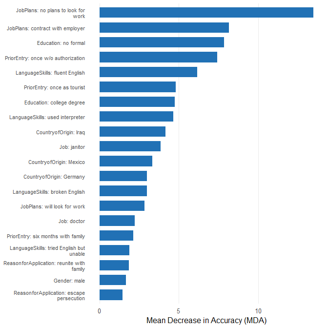

# cjdiag

Tools for attribute-level importance and attendance in conjoint survey
experiments — which attribute levels drive choices, how they rank, and
which ones respondents ignore.

## Why cjdiag?

Standard conjoint analysis tools
([cjoint](https://cran.r-project.org/package=cjoint),
[cregg](https://github.com/leeper/cregg)) estimate *what* respondents
prefer — Average Marginal Component Effects (AMCEs) and marginal means.
But they cannot tell you *how* respondents decide: which attributes they
actually attend to, whether they process information hierarchically, or
which attribute levels they ignore entirely.

**cjdiag** fills this gap with five diagnostic methods that reveal the
decision process behind conjoint choices.

## Installation

``` r
# Install from GitHub (CRAN submission pending)
# install.packages("pak")
pak::pak("dkarpa/cjdiag")
```

## Quick Start

``` r
library(cjdiag)
data(immig)

rf <- cj_fit(
  Chosen_Immigrant ~ Gender + Education + LanguageSkills +
    CountryofOrigin + Job + JobExperience + JobPlans +
    ReasonforApplication + PriorEntry,
  data = immig,
  method = "forest"
)

rf
#> Conjoint Random Forest 
#> ====================== 
#> 
#> Resolution: levels
#> Trees: 500
#> OOB Error: 40.3%
#> Observations: 2,000
#> Attributes: 9
#> Levels: 50
#> 
#> Top 10 levels by MDA:
#> 
#> # A tibble: 10 × 5
#>     rank attribute       level                       mda root_pct
#>    <int> <chr>           <chr>                     <dbl>    <dbl>
#>  1     1 JobPlans        no plans to look for work 13.5      15.4
#>  2     2 JobPlans        contract with employer     8.18     11.2
#>  3     3 Education       no formal                  7.87      7.4
#>  4     4 PriorEntry      once w/o authorization     7.42     10.4
#>  5     5 LanguageSkills  fluent English             6.16      8.2
#>  6     6 PriorEntry      once as tourist            4.83      2.4
#>  7     7 Education       college degree             4.75      6.4
#>  8     8 LanguageSkills  used interpreter           4.66      5.6
#>  9     9 CountryofOrigin Iraq                       4.15      4.6
#> 10    10 Job             janitor                    3.87      3
```

### Importance Plot

``` r
plot(rf, top_n = 20)
```



### Attribute Ranking

``` r
plot(rf, type = "rank")
```


### Decision Tree

``` r
tr <- cj_fit(
  Chosen_Immigrant ~ Gender + Education + LanguageSkills +
    CountryofOrigin + Job + JobExperience + JobPlans +
    ReasonforApplication + PriorEntry,
  data = immig,
  method = "tree"
)

plot(tr)
```


## Methods

All methods are accessed through a single function:
`cj_fit(formula, data, method)`.

| Method        | `method =`      | Question                                    | Key output                       |
|---------------|-----------------|---------------------------------------------|----------------------------------|
| Random Forest | `"forest"`      | Which attributes matter most?               | MDA ranking, root node rates     |
| Decision Tree | `"tree"`        | How are decisions structured?               | Tree splits, variable importance |
| CRT/HierNet   | `"crt"`         | Which levels genuinely drive choices?       | Lambda survival path             |
| Nested MM     | `"nmm"`         | In what order do attributes settle choices? | Decisiveness ranking             |
| Marginal R-sq | `"marginal_r2"` | Which attributes did each respondent use?   | Per-respondent R-squared         |

## Plot Customization

All plot methods return ggplot2 objects and accept customization
parameters:

``` r
# Colorblind-safe palette
plot(rf, palette = "colorblind")

# Rename attributes in display
plot(rf, attribute.names = c(LanguageSkills = "English Proficiency"))

# Full ggplot2 theme override
plot(rf, theme = ggplot2::theme_classic(base_size = 14))
```

Three palettes available: `"default"`, `"colorblind"` (Okabe-Ito),
`"grey"`.

Set defaults once with
[`set_cjdiag_theme()`](https://dkarpa.github.io/cjdiag/reference/set_cjdiag_theme.md)
and
[`set_cjdiag_labels()`](https://dkarpa.github.io/cjdiag/reference/set_cjdiag_labels.md).

## Related Packages

**cjdiag** is complementary to packages that estimate AMCEs and design
conjoint experiments:

- [cjoint](https://cran.r-project.org/package=cjoint) — AMCE estimation
  (Hainmueller, Hopkins & Yamamoto)
- [cregg](https://github.com/leeper/cregg) — AMCE and marginal means
  with tidy output
- [projoint](https://cran.r-project.org/package=projoint) — full
  conjoint pipeline
- [cbcTools](https://cran.r-project.org/package=cbcTools) — conjoint
  experiment design and power analysis

Run cjoint or cregg for AMCEs, then cjdiag to diagnose how respondents
actually made those choices.

## Getting Started

For a full walkthrough, see the [Introduction
vignette](https://dkarpa.github.io/cjdiag/articles/introduction.html).

## Citation

``` r
citation("cjdiag")
```

``` R
To cite package 'cjdiag' in publications use:

  Karpa D (2026). _cjdiag: Diagnostic Tools for Conjoint Survey
  Experiments_. R package version 0.2.0,
  <https://github.com/dkarpa/cjdiag>.

A BibTeX entry for LaTeX users is

  @Manual{,
    title = {cjdiag: Diagnostic Tools for Conjoint Survey Experiments},
    author = {David Karpa},
    year = {2026},
    note = {R package version 0.2.0},
    url = {https://github.com/dkarpa/cjdiag},
  }
```
